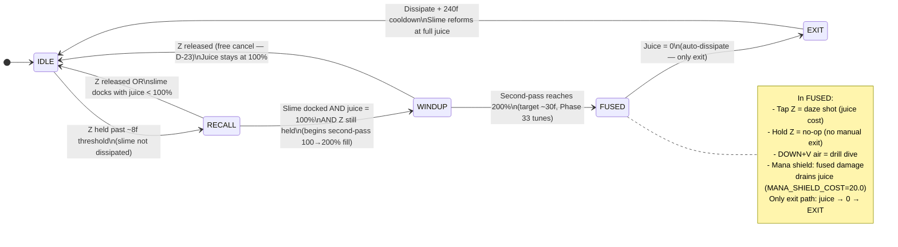

# Fusion Lifecycle Design (v2.0 prototype)

This document is the **LOCKED design contract** for v2.0 fusion behavior. It is the single source of truth that downstream phases are built against:

- **Phase 32 (Fusion Manager + Protocol Refactor)** is HARD-GATED on the SHA in this doc's frontmatter. The refactor verifies `locked_commit` against git history before writing its PLAN, then builds against this spec — not against live `player.py` drift, not against memory, not against the pre-pivot ROADMAP.
- **Phase 33 (Per-Ability Feel Pass)** reads the Drill-Dive Contract section (§ Drill-Dive Contract, FUS-03) as its tuning target. Phase 33 may retune values live; it may NOT change behavioral invariants without re-locking this doc.
- **Phase 31 (Animation + Particle Bank)** subscribes to the event-bus events enumerated in § Fusion FSM (`drill_start`, `drill_block_break`, `drill_end`) plus the existing `fuse_start` / `fuse_end`. Events are anim side-channel hooks; they do not drive gameplay state.

**Scope pivot — one fusion, not six.** The v2.0 prototype ships **exactly one fusion mechanic: Drill Dive**. The five other v1.1 fusion abilities (Slime Ram, Directional Hold, Charge Shot, Bubble Shield, Slime Boost) are **cut from the prototype** — enumerated later in § Cut Abilities, out of prototype scope, revisit post-prototype. This is per D-01 / D-02 / D-29 of `.planning/phases/30-fusion-lifecycle-design-doc/30-CONTEXT.md`.

The prototype combat fantasy is **shoot to daze the boss → drill to finish** (per D-03). This doc defines the input model, FSM, juice economy, and drill contract that make that loop feel natural.

## Requirements (defined in this document)

Per D-32, the `FUS-XX` requirement IDs referenced in `.planning/ROADMAP.md` are defined inline here (no separate REQUIREMENTS file exists for v2.0). Each ID traces to a named section heading below, so downstream plans can link to a specific anchor.

- **FUS-01**: Fusion lifecycle FSM defines `IDLE → RECALL → WINDUP → FUSED → EXIT` with activation input, 100% juice gate at WINDUP entry, cancel/release rules at each phase, and a single auto EXIT path (juice → 0 → dissipate + cooldown). Under the "200% charge" mental model (D-23a), WINDUP is the visible second-pass fill from 100→200% of the juice bar; imminent-fusion telegraph at ≥90% (D-23b); ~30-frame cancel window at base (D-23c). See [§ Fusion FSM](#fusion-fsm) and [§ Juice Economy](#juice-economy).
- **FUS-02**: Unified input model. Z is the slime/fusion button (tap = spit/daze, hold = recall/fuse — fused state has **no hold action**); DOWN+V in air is the dive verb (pogo unfused, drill fused); tap/hold disambiguation uses a ~8-frame threshold (tuned in Phase 33 — current v1.3 code uses `SPIT_HOLD_THRESHOLD = 16` frames). See [§ Input Model](#input-model).
- **FUS-03**: Drill-dive v1.3 regression contract. Documented velocity, per-block juice cost, CRACKED_V handling, and entry/exit conditions serve as Phase 32's parity target — verified by inspection and smoke test, no pytest required (per D-28). See [§ Drill-Dive Contract](#drill-dive-contract).

## Scope Pivot Rationale

**Per D-01**: the prototype ships **ONE** fusion mechanic: **Drill Dive**. The five other v1.1 fusion abilities — Slime Ram, Directional Hold, Charge Shot, Bubble Shield, Slime Boost — are **cut from the prototype**. They are NOT deleted from design thinking; they are out of prototype scope, revisit post-prototype (see [§ Cut Abilities](#cut-abilities) for one-line rationale per ability, per D-02).

**Why cut?** The five abilities shipped in v1.1 as *expansion-era* content — they validated the fusion-verb space, but each one added a partner-compound in a six-ability matrix that no longer pays for itself in a **feel-first prototype**. The cuts are prototype focus, not rejection. Post-prototype transition to Godot/Unity (the natural re-evaluation point per 30-CONTEXT.md Deferred Ideas) is when the full six-ability palette may return.

**Per D-03**: the prototype's fusion loop is **"shoot to daze the boss → drill to finish."** This is the combat fantasy that `.planning/PROJECT.md` already names ("using a companion slime to power a destructive Drill Dive that enables both exploration and combat"). The whole input model (Z = slime/fusion button; DOWN+V = dive verb, pogo unfused / drill fused) exists to make that two-step loop read as **natural, readable, and committed** — not as "pick one of six fusion flavors from a menu."

**Per D-02 — Code-strip follow-up.** The cut-ability code still exists in the tree today:
- `src/entities/player.py` — `start_ram()` / `apply_ram_physics()` / `end_ram()`, `bubble shield` logic, `charge_shot_*`, `start_boost` / `end_boost`, `has_shield` / `has_boost` flags, `ram_dx` / `ram_dy` state.
- `src/entities/slime.py` — any shield/charge-shot/boost hooks.
- `assets/physics-schema.json` — tuning groups `ram`, `charge_shot`, `boost`, `bubble_shield`.
- `.planning/ROADMAP.md` references to six-ability refactor (being updated by this plan's Task 8).

A **separate cut-ability-code-strip phase** must run between Phase 30 (this doc) and Phase 32 (fusion refactor) to remove that code. It's tracked as a Deferred Idea in `30-CONTEXT.md` ("NEW PHASE NEEDED — cut-ability code strip"). This plan's Task 8 adds a pointer note to ROADMAP.md; inserting the actual phase happens via `/gsd-insert-phase` after Phase 30 closes. The code-strip phase is a **HARD GATE** before Phase 32 begins — Phase 32 must not start until cut-ability code is out of the tree, to prevent the refactor from accidentally preserving dead code in the new `src/fusion/` package.

**Per D-29**: this is a *single comprehensive file*. No separate contract files. No separate FSM diagram artifact. All seven content sections (Input Model, Fusion FSM, Juice Economy, Drill-Dive Contract, Cut Abilities, Acceptance Checklist, Lock Protocol) live inline below.

## Input Model

*Anchor: `input-model`. Defines FUS-02.*

This section is written **before** § Fusion FSM (per Pitfall 6 of `30-RESEARCH.md`): the FSM transitions reference Z-tap / Z-hold / DOWN+V semantics that must be disambiguated here first.

### Z — the slime/fusion button

- **Logical action:** `spit` (physical keys: **Z / J / GAMEPAD B**, per `src/core/input.py:4-14`).
- **Uniform semantic (D-10):** `tap = projectile, hold = toggle fusion state`. No mode-specific rebinds — Z means the same thing whether the player is fused, unfused, mid-drill, or mid-recall. Tap always starts a projectile; hold always drives the fusion state machine.
- **Tap/hold disambiguation threshold (D-11):** target **~8 frames** (doc target; Phase 33 tunes live via the panel). Tap below threshold → spit/daze shot. Hold past threshold → RECALL (when unfused). **Fused state has no hold action** — once fused, Z hold is a no-op (manual exit was removed from the design 2026-04-20; see [§ Fusion FSM](#fusion-fsm)).
    - Current v1.3 code uses `SPIT_HOLD_THRESHOLD = 16` frames (`assets/presets/_v1.3-reference.json` slime group; `src/core/input.py` `was_tap` primitive). The doc deliberately targets a tighter ~8-frame value — the 16-frame threshold was a v1.1 compromise that feels sluggish on gamepad; Phase 33 retunes to ~8 as the design target.
- **Tap/hold shared primitive:** both Z and V tap/hold disambiguation reuse the same `was_tap(action, threshold)` / `hold_frames(action)` primitives from `src/core/input.py`. Per-action threshold values are named in the juice-economy / drill-dive sections and Phase 33 tunes them.

#### Unfused Z actions (D-10, D-11, D-12)

- **Tap (held ≤ threshold):** fire **spit** projectile. Weak, free (no juice cost). Uses existing `slime.spit()` code path.
- **Hold, juice < 100%:** **RECALL** — slime begins moving toward player at `RECALL_SPEED = 4.0 px/frame` (`_v1.3-reference.json` slime group). While Z is held AND slime is active (not dissipated), **accelerated regen** activates once slime is docked at player (distance ≤ `RECALL_OVERLAP_DIST = 4 px`). Regen rule formalized in [§ Juice Economy](#juice-economy).
- **Hold, juice = 100% AND slime docked at player:** begins **SECOND-PASS CHARGE** (D-23a). The juice bar overlay fills from 100→200% as a visible second pass. Reaching 200% latches FUSED. Continuous hold completes the ritual — no re-press needed (D-12).
- **Release during second-pass (before 200%):** **free cancel** per D-23. Slime returns to **follow mode**, NOT frozen — freezing would conflict with spit responsiveness since Z is also the shoot button (D-12 forbids this). Juice stays at 100%. No cost, no punishment.

#### Fused Z actions (D-13, D-14)

- **Tap (held ≤ threshold):** fire **daze shot**. Same projectile sprite/physics as spit but upgraded: juice cost + daze-on-hit effect. Per D-14, reuses the spit code path; the upgrade is a visual layer (larger sprite / particle trail) plus a juice cost on fire. Daze effect details (stun duration) carry forward from existing boss stagger logic where present; Phase 33 retunes.
- **Hold past threshold:** **no-op** — fused state has no hold action. Manual unfuse was removed from the design 2026-04-20 (post-lock decision): the second-pass commitment ritual is meant to feel committed, and an easy bail-out cheapened it. Once fused, the only path back to IDLE is via auto-dissipate when juice empties — see [§ Fusion FSM](#fusion-fsm) and Exit (b) in [§ Drill-Dive Contract](#drill-dive-contract). This **overrides D-08(c)** in `30-CONTEXT.md` (which had marked manual mid-drill unfuse as tunable).

### V — the dive verb

- **Logical action:** `dash` (physical keys: **V / K / GAMEPAD X**, per `src/core/input.py:4-14`).
- **Unfused DOWN+V in air = pogo bounce** (D-04). Shovel-Knight-shovel-drop style. Strikes downward; bounces on contact with enemies and breakables only; pure solid ground = no bounce, just lands. Pogo is **free** per D-05 — no juice cost, no cooldown, always available. Juice is reserved for fusion. Per D-06, pogo teaches the drill's downward commitment **before the player ever fuses** — same input (DOWN+V in air), fusion upgrades the outcome. This turns drill from "learn a new button" into "watch fusion transform a familiar verb."
- **Fused DOWN+V in air = pure plunge (Drill Dive)** per D-07. No bounce. Drills through soft / CRACKED_V blocks, consumes juice per block. Full behavioral contract in [§ Drill-Dive Contract](#drill-dive-contract). Exit conditions per D-08: (a) solid terrain, (b) juice = 0 (auto-unfuse + dissipate). **D-08(c) (manual unfuse via Z-hold mid-drill) was removed from the design 2026-04-20** — drill cannot be aborted mid-flight. Drill retains no pogo behavior per D-09 — **commitment is the point**.

### Implementation remap note — Phase 32 rebind

> Current v1.3 code routes drill activation through the **`jump`** action (DOWN+SPACE — see `src/entities/player.py:443-456`, specifically `if input_manager.btnp("jump") and input_manager.btn("down") and self.has_drill and not self.is_grounded`). This doc targets the **`dash`** action (DOWN+V) per `.planning/PROJECT.md` canonical decision ("V button unified (D-07/D-10/D-22) V=dash unfused, DOWN+V=drill dive; kick removed"). **Phase 32 remaps drill activation from `jump` to `dash`** as part of the single-fusion-ability refactor. The mid-drill jump-cancel at `src/entities/player.py:463-468` is **removed entirely** — drill exits only via solid contact (a) or juice empty (b); there is no Z-hold replacement and no UNFUSE_WINDUP routing. This is a v1.3 implementation detail being corrected, **not a design change** — design intent has always been V.

## Fusion FSM

*Anchor: `fusion-fsm`. Defines FUS-01 (FSM side).*

The fusion lifecycle is a five-state finite state machine: **`IDLE → RECALL → WINDUP → FUSED → EXIT`** (per D-21). Per D-22, "docked" is not a separate state — it is frame 0 of WINDUP (the moment slime reaches the player with Z held AND juice = 100% is the moment WINDUP/second-pass begins). EXIT has a single sub-path: **auto-dissipate** when juice → 0 (slime dissipates → 240f cooldown → reforms at full juice). Free-cancel is available at WINDUP per D-23 (see § State-by-state rules below).

> **Manual exit removed from the design 2026-04-20** (post-lock decision). The original draft included `UNFUSE_WINDUP`, `EXIT_MANUAL`, and a `manual_unfuse_start` event for a Z-hold bail-out path while FUSED. Those states / event were stripped because the second-pass commitment ritual is meant to feel *committed* — an easy bail-out cheapened it. Once fused, the only path back to IDLE is via auto-dissipate. This **overrides D-08(c)** in `30-CONTEXT.md`. (The git audit trail preserves the original design — see `prior_locked_commit` in this doc's frontmatter.)

### Mermaid state diagram



### ASCII table fallback

Provided immediately after the Mermaid block so grep-based content checks pass and the doc is readable without Mermaid rendering (D-30 permits either format; this doc ships both).

| From | To | Trigger | Side effects |
|------|----|---------|--------------|
| IDLE | RECALL | Z held ≥ ~8f threshold, slime not dissipated | Slime begins recall (RECALL_SPEED=4.0 px/f) |
| RECALL | IDLE | Z released OR slime docks with juice < 100% | Slime returns to follow mode (NOT freeze, per D-12) |
| RECALL | WINDUP | Slime docked (dist ≤ 4 px, RECALL_OVERLAP_DIST) AND juice = 100% AND Z still held | Second-pass charge begins (100→200% overlay fill); `fuse_start` NOT yet emitted |
| WINDUP | IDLE | Z released (free cancel, D-23) | Slime returns to follow; juice stays at 100%; no cost, no punishment |
| WINDUP | FUSED | Second-pass charge reaches 200% (target ~30f, Phase 33 tunes) | `fuse_start` emitted; player and slime latched |
| FUSED | EXIT | Juice = 0 (only exit path) | `fuse_end` emitted; slime dissipates; SLIME_DISSIPATE_COOLDOWN=240f before reform |
| EXIT | IDLE | 240f cooldown elapses | Slime reforms at full juice (v1.1 D-05 retained) |

### State-by-state rules

- **IDLE:** Slime following, player unfused. Baseline passive juice regen active whenever slime is active (not dissipated / not fused / not holding). Rate: `JUICE_REGEN_RATE = 0.5 juice/frame` (`_v1.3-reference.json` slime group; applied each frame in `src/entities/slime.py:166`). See [§ Juice Economy](#juice-economy).
- **RECALL:** Z held, slime moving toward player at `RECALL_SPEED = 4.0 px/frame`. **Accelerated regen** activates once slime is docked at player with Z still held — "docked" = center-to-center distance ≤ `RECALL_OVERLAP_DIST = 4 px` (`_v1.3-reference.json` slime group; `physics-schema.json:103`). Per D-17 + D-22, docked-with-Z-held is the "power up for fusion" ritual — stand safe, pull slime in, charge.
- **WINDUP:** **Second-pass charge fill** — the juice bar overlay fills 100→200% as a visible second pass (distinct color/style from base juice fill). This IS the cancel window per D-23c. Target **~30 frames** at base (~0.5s @60fps), Phase 33 tunes. Frame 0 of WINDUP IS the "docked" moment per D-22 (not a separate state). Reaching 200% latches FUSED; `fuse_start` event emits at the latch (NOT at windup begin). Per D-23a, this is the "commitment ritual" — first pass 0→100% = readiness, second pass 100→200% = commitment. Per D-23b, juice bar pulses/flashes at ≥90% as an imminent-fusion telegraph (pre-WINDUP cue; see [§ Juice Economy](#juice-economy)).
- **FUSED:** Latched state. Z-tap fires **daze shot**; **Z-hold is a no-op** (manual exit removed); DOWN+V in air = **drill dive**. Mana shield remains active — `MANA_SHIELD_COST = 20.0 juice per fused damage hit` (`_v1.3-reference.json` fusion group; v1.1 D-04 retained). Remaining juice is spent by fused actions (D-19, D-20). **Only exit:** juice → 0 → EXIT (auto-dissipate). See [§ Drill-Dive Contract](#drill-dive-contract) for drill behavior and costs.
- **EXIT** (juice → 0, only exit path): Slime `dissipate()`; `SLIME_DISSIPATE_COOLDOWN = 240 frames` (= 4.0s @60fps; `_v1.3-reference.json` slime group) before slime reforms at full juice. Dissipation IS the punishment for over-spending per D-24 (v1.1 D-05 retained).

### Event emissions

Event names use snake_case verb-noun-tense per the naming convention observed in `src/anim/event_bus.py` (`fuse_start`, `fuse_end`, `drill_impact`, `ram_start`, `spit`). Per MEMORY Reanimator-style anim architecture constraint, these events are **anim side-channel hooks** — they mirror gameplay state, they do NOT drive the gameplay FSM. Phase 31 subscribes to them for animation content; gameplay state transitions remain authoritative.

**Existing events** (already emitted by `src/anim/event_bus.py` today):

- `fuse_start` — emitted on `WINDUP → FUSED` transition. Mirrors the current v1.1 `player.fuse()` call site (`src/entities/player.py:89-97`; current trigger is charge-to-fuse at `player.py:419-423` — `arrived and slime.juice >= slime.max_juice`).
- `fuse_end` — emitted on the single `EXIT` transition (auto-dissipate when juice → 0). Mirrors the current v1.1 `player.unfuse()` call site (`src/entities/player.py:99-110`).

**New events proposed by this doc** (NOT implemented in Phase 30 — documented here; Phase 32 implements them):

- `drill_start` — fired at drill-dive activation (in FUSED state with DOWN+V held). Anim hook for drill windup/plunge frame. Today code has no per-activation drill event; only `drill_impact` on landing.
- `drill_block_break` — fired per-block destruction during drill. **Distinct from `drill_impact`** (which is landing on solid). Enables per-break particle/shake in Phase 31/35 without conflating with the landing event. Today code has no per-block event (the shake/hitstop is triggered by `on_block_break()` directly at `player.py:235-239`).
- `drill_end` — fired on any drill exit (solid contact, or juice=0). Pairs with `drill_start` as the anim lifecycle bookend.

### Cross-references

The 100% juice gate logic, accelerated regen rule, and cancel-window semantics are specified in [§ Juice Economy](#juice-economy) — this section references them by name. The `drill_start` / `drill_block_break` / `drill_end` events and all drill-specific costs / velocities are specified in [§ Drill-Dive Contract](#drill-dive-contract).

## Juice Economy

*Anchor: `juice-economy`. Defines FUS-01 (economy side).*

**Juice is mana. The juice bar is a readiness meter, not a duration bar** (per D-15, D-16). Full = ready to fuse. Anything less = waiting, regenerating, or spending. Once fused, remaining juice is burn-down for fused actions (drill, daze shot, mana shield). The 100% gate is what turns juice from a slider into a binary readiness signal — and the second-pass charge overlay (100→200%) is what makes the gate *legible* to the player.

### Current v1.3 values (authoritative baseline)

| Property | v1.3 Value | Source |
|----------|-----------|--------|
| `JUICE_MAX` | 200.0 | `assets/presets/_v1.3-reference.json` (slime group) |
| `JUICE_REGEN_RATE` (passive) | 0.5 juice/frame (= 30 juice/sec; full refill from 0 in ~6.67s @60fps) | `_v1.3-reference.json` (slime group); applied in `src/entities/slime.py:166` |
| Accelerated regen rate (NEW) | **Draft: 2× passive = 1.0 juice/frame** (= 60/sec; full refill from 0 in ~3.33s @60fps). Phase 33 tunes. | This doc (per Open-Q #5 resolution in `30-RESEARCH.md`) |
| `MANA_SHIELD_COST` (per fused damage hit) | 20.0 juice | `_v1.3-reference.json` (fusion group); v1.1 D-04 retained |
| `SLIME_DISSIPATE_COOLDOWN` | 240 frames (= 4.0s @60fps) | `_v1.3-reference.json` (slime group); v1.1 D-05 retained |
| `SLIME_MAX_DIST` (fuse-eligibility range) | 100 px | `_v1.3-reference.json` (slime group); used in drill-entry precondition at `src/entities/player.py:446-450` |

### The 100% Gate (D-15, D-16)

- **Rule:** fusion requires `slime.juice == slime.max_juice` (i.e., 100% of `JUICE_MAX`) to initiate. Anything less → no fuse, even if Z is held with slime docked.
- **Binary readiness semantic:** the juice bar reads as *ready / not ready*, not as *seconds of fusion remaining*. This collapses three-bit cognitive load (juice, fusion, ability) into one-bit at decision time: "can I fuse right now? Look at the bar. Full? Yes."
- **Design primitive (D-16):** "oh I need 1 more juice for this puzzle." Level design can intentionally place drill-gated blocks adjacent to juice-starved zones (hazards that drain juice, or long traversals without spit pickups) to create felt scarcity. The 100% gate is what makes that design moment possible — with a continuous slider, the player always has *some* juice and the puzzle degenerates into "drill inefficiently but still drill."
- **Implementation note — gate already exists for charge-to-fuse:** the 100% gate is NOT a new rule being invented by this doc. The v1.1 charge-to-fuse path already enforces it:
    ```python
    # src/entities/player.py:419-423
    if self.is_charging_recall and slime.is_recalling:
        arrived = slime.update_recall(self.x, self.y)
        if arrived and slime.juice >= slime.max_juice:   # <-- 100% gate, existing
            self.fuse(slime)
    ```
    What IS new: the **drill-entry path** currently gates on `slime.juice > 0` (`src/entities/player.py:447`), not 100%. Phase 32 **aligns the drill-entry path to the same 100% gate** that charge-to-fuse already uses. This is a **consolidation** (one gate for all fusion entry paths), not an invention. Pitfall 2 of `30-RESEARCH.md` flags this distinction explicitly — "formalizing existing behavior, not inventing a new rule."

### Second-Pass Charge — the 200% to fuse model (D-23a, D-23b, D-23c)

The second-pass charge is the **trigger model** that prevents accidental fusion. Without it, the only safety against auto-fuse-on-dock-at-100% is the WINDUP cancel window alone — invisible to the player and tight. The second-pass gives the player **three layers of defense** against "I held Z to recall and accidentally fused":

1. **Mental model — doubled juice bar (D-23a).** Fusion is framed as "double-charging" the juice bar:
   - First pass 0→100% = **readiness** (passive + accelerated regen during hold).
   - Second pass 100→200% = **commitment ritual** (only fills while Z is held AND slime is docked; visible as a distinct-color overlay).
   The metaphor sells the ritual: full readiness, then commitment, both legible on the same bar. The player reads "I am now over-filling the bar" not "I triggered some invisible timer."
2. **Trigger.** When `juice == 100%` AND slime is docked AND Z is held, the second-pass overlay begins filling on top of the base juice bar from 100% to 200%. This second-pass overlay **IS** the WINDUP state (see [§ Fusion FSM](#fusion-fsm)). `fuse_start` emits when the overlay reaches 200%, NOT when the overlay begins filling.
3. **Visual.** Second-pass overlay should render in a **distinct color/style** from the base juice fill so the player reads it as a separate phase, not "more juice." Exact color/style deferred to Phase 31 (anim/particle) and Phase 33 (feel pass); this doc only specifies the invariant (distinct, legible, same spatial location as juice bar).
4. **Cancel (D-23 free cancel).** Release Z at any time during the second pass = free cancel. Slime returns to follow. Juice stays at 100% (the cancel does NOT reset juice). No cost, no punishment. This is the **forgiving** flavor chosen for the prototype — Phase 33 may retune to a costed cancel if playtest shows the forgiveness enables exploit loops.
5. **Latch.** Reaching 200% latches FUSED. `fuse_start` event emits at the latch moment (not when second-pass begins, not mid-fill). This is the single authoritative "you are fused" moment.
6. **Imminent-fusion telegraph at ≥90% (D-23b).** Juice bar pulses or flashes visibly at `juice >= 0.9 * max_juice` to signal **"fusion is one heartbeat away."** This is a **pre-100%** cue — fires before the second-pass even starts. Gives the player a chance to release Z (or avoid pressing it) so they don't accidentally enter the commitment ritual when juice fills passively during normal gameplay. Pulse style/color tuned in Phase 33.
7. **Cancel window duration (D-23c).** Target **~30 frames at base** (~0.5s @60fps). Generous enough to avoid accidental fusion in normal play; short enough not to feel sluggish during intentional fusion. Phase 33 retunes if playtest shows under/over.

**Why three layers?** The failure mode "I held Z to recall and accidentally fused" is the single biggest risk to the new input model (Z = both recall and fusion trigger). Three layers (visible bar phase, explicit release cue at 90%+, generous cancel window during 30f second-pass) give the player **physical agency, visual warning, and a cheap escape** at every phase of the approach.

### Accelerated Regen Ritual (D-17, D-18)

- **Condition:** while Z is held AND slime is active (not dissipated) AND slime is docked at the player (`distance ≤ RECALL_OVERLAP_DIST = 4 px`), juice regenerates at the **accelerated rate**. Draft: **2× passive = 1.0 juice/frame** (= 60 juice/sec); Phase 33 tunes multiplier against playtest.
- **Baseline (passive) regen** continues at `JUICE_REGEN_RATE = 0.5 juice/frame` any time the slime is active and not fused / not holding, per D-18. This is the existing v1.1 rate (`src/entities/slime.py:166`); nothing changes for passive regen.
- **Semantic:** accelerated regen is the **"power up for fusion"** ritual — stand safe, pull slime in, charge, commit. Texture is Hollow-Knight-Focus-heal / Zelda-boomerang-charge: committed time in exchange for a power state. The player trades movement freedom (has to hold Z + stand-ish still so slime can dock) for faster access to fusion.
- **Implementation note:** no "accelerated regen" code exists today (verified in `30-RESEARCH.md` § Juice Regen — only `JUICE_REGEN_RATE` applied unconditionally in `slime.update`). Phase 32 implements the accelerated branch (conditional on Z-held + docked + not-dissipated). Phase 33 tunes multiplier.

### Juice Consumption During Fuse (D-19, D-20)

Once FUSED, the 100% gate **no longer applies** (D-19 — gate is for *entering*, not *staying*). Remaining juice is spent by fused actions:

- **Daze shot** (tap Z while FUSED): cost is TBD — reuses the existing `SLIME_SPIT_COST` primitive with upgrade factor. Phase 33 picks a value (likely equal to or slightly above v1.3 spit cost, since per D-14 the daze shot is mechanically the same projectile with a juice cost + daze-on-hit effect).
- **Drill activation:** `DRILL_ACTIVATION_COST = 5.0 juice` (`_v1.3-reference.json` drill group). See [§ Drill-Dive Contract](#drill-dive-contract).
- **Drill per-block cost / refund:** `DRILL_CRACKED_V_COST = 20.0` (CRACKED_V gate), `DRILL_BLOCK_REFUND = +15.0` (soft destructible passthrough — this is a **refund**, not a cost). See [§ Drill-Dive Contract](#drill-dive-contract) for the full table.
- **Drill impact** (solid-terrain landing): `DRILL_IMPACT_COST = 20.0 juice`.
- **Mana shield** (fused damage taken): `MANA_SHIELD_COST = 20.0 juice per hit` (v1.1 D-04 retained). Any fused damage drains juice instead of HP.

Per D-20: **fused duration = juice-at-fuse-moment minus what fused actions consume.** Every fused action is a trade — "stay fused longer" vs. "drill/shoot now." The player is always running a juice clock once FUSED.

**Regen does NOT apply while fused.** Current v1.1 behavior: `slime.update` early-returns before the regen line when `is_fused` is true (confirmed in `30-RESEARCH.md` § Juice during fuse). This doc retains that rule — juice is locked to burn-down during FUSED; only drains, never regens.

### Dissipation on Juice-Empty (D-24)

- **Trigger:** juice reaches 0 during FUSED → auto `unfuse(slime, dissipate=True)` path → `slime.dissipate()` at `src/entities/slime.py:82-89`.
- **Effect:** `SLIME_DISSIPATE_COOLDOWN = 240 frames` (= 4.0s @60fps) during which `slime.recall()` early-returns (slime is uncontrollable). This IS the punishment for over-spending — lose slime for 4 seconds.
- **Reform:** after cooldown elapses, slime reforms at **full juice** (v1.1 D-05 retained; `slime.py:91-101`). This restores readiness but costs the player 4 seconds of dual-hero presence.
- **Design rationale:** dissipation keeps the juice-empty state from being trivial ("just regen a bit and fuse again"). The cooldown enforces that over-spending fusion juice has a real cost — you lose not just juice, but the slime companion entirely for a window. This is what makes the 100% gate + burn-down economy feel *committed* rather than *incremental*.

## Drill-Dive Contract

*Anchor: `drill-dive-contract`. Defines FUS-03.*

This section captures v1.3 drill-dive behavior precisely enough to serve as **Phase 32's parity target** — verified by inspection + smoke test (no pytest required per D-28). The contract is **behavioral, not frame-for-frame identity** (per D-27); Phase 33 is permitted to retune values during the feel pass after Phase 32 confirms parity.

**Citation rule (per `30-RESEARCH.md` Anti-patterns):** every concrete value in this section cites a source. Prose like "about 20 juice" is wrong. `20 juice (_v1.3-reference.json drill group; DRILL_IMPACT_COST)` is right. Drill values are drawn from `assets/presets/_v1.3-reference.json` — the authoritative v1.3 baseline — per Pitfall 1 of `30-RESEARCH.md` (v1.3 vs v2.0-default drift: drill values happen to match, but the v1.3 file is the regression target by decree).

### Activation contract

| Property | Value | Source |
|----------|-------|--------|
| Target activation input | **DOWN + V** (logical `dash` action) | D-07 + `src/core/input.py:4-14` |
| Current v1.3 activation input (implementation detail) | DOWN + SPACE (logical `jump` action — Phase 32 remap target per [§ Input Model](#input-model) remap note) | `src/entities/player.py:443-456` |
| Preconditions (v1.3 current) | `has_drill` item, airborne (not grounded), `slime.juice > 0`, slime distance² < `SLIME_MAX_DIST² = 100² = 10000` | `src/entities/player.py:446-450`; `_v1.3-reference.json` slime group |
| Post-doc precondition (v2.0 target) | Same + **juice = 100%** (adopts the existing charge-to-fuse gate — see [§ Juice Economy](#juice-economy)) | This doc; `src/entities/player.py:419-423` existing gate for reference |
| Entry side-effects | `state = "DIVING"`, `fuse(slime)`, `dy = DRILL_SPEED`, `dx = 0`, `slime.consume(DRILL_ACTIVATION_COST)`, emit NEW `drill_start` event | `src/entities/player.py:451-455` |

### Physics contract

| Property | v1.3 Value | Source |
|----------|-----------|--------|
| `DRILL_SPEED` (vertical velocity; re-clamped each frame) | **2.0 px/frame** | `_v1.3-reference.json` drill group; `assets/physics-schema.json:79`; applied in `src/entities/player.py:662-663` |
| `DRILL_DRIFT_SPEED` (horizontal drift when LEFT/RIGHT held) | **0.5 px/frame** | `_v1.3-reference.json` drill group; `assets/physics-schema.json:80`; applied in `src/entities/player.py:665-671` |
| `DRILL_ACTIVATION_COST` (paid at drill entry) | **5.0 juice** | `_v1.3-reference.json` drill group; `assets/physics-schema.json:82` |
| `DRILL_IMPACT_COST` (paid on solid-terrain landing) | **20.0 juice** | `_v1.3-reference.json` drill group; `assets/physics-schema.json:81` |
| `DRILL_BLOCK_REFUND` (soft-destructible passthrough) | **+15.0 juice** (REFUND, not cost) | `_v1.3-reference.json` drill group; `assets/physics-schema.json:83` |
| `DRILL_CRACKED_V_COST` (gate block break) | **20.0 juice** | `_v1.3-reference.json` gates group; `assets/physics-schema.json:131` |
| Gravity during drill | `dy` is re-assigned to `DRILL_SPEED` each frame in `apply_diving_physics`, so net gravity effect = **0** (drill is a clamp, not an additive velocity). Gravity only bites if drill is somehow read-through by another state. | `src/entities/player.py:662-663, 689-693` |
| `MAX_FALL_SPEED` clamp | **N/A during drill** (v1.3 `MAX_FALL_SPEED = 2.5`; drill explicitly sets `dy = 2.0` each frame, not affected by the clamp) | `_v1.3-reference.json` (slime/physics group) |
| i-frames during drill | **NONE** (preserve v1.3 per Open-Q #1 resolution). Drill is NOT invincible — this is distinct from ram (`ram_iframes = 9999` during ram, `DASH_IFRAMES = 16` post-ram). Flag for Phase 33 playtest: if the non-invincible drill feels punishing, add i-frames then. | `src/entities/player.py` — no `invuln_timer` assignment during DIVING state (verified by grep) |

### Block-break branch contract

During DIVING, each frame `move_and_collide` checks the tile the player would enter via `level_map.get_destructible_at`. The branch behavior per tile type:

- **Soft destructible** (non-CRACKED_V). Code: `src/entities/player.py:770-786`.
    1. `level_map.remove_tile(tx, ty)`.
    2. `game.spawn_explosion(...)`.
    3. `slime.refill(DRILL_BLOCK_REFUND)` — **+15.0 juice refunded** to slime.
    4. `on_block_break()` — sets `game.shake_timer = DRILL_SHAKE_DURATION` (12 frames) and `game.stop_frames = DRILL_HITSTOP_FRAMES` (6 frames). `src/entities/player.py:235-239`; `assets/physics-schema.json:85-88`.
    5. Drill **continues through** (early `return` in the block-break branch; `dy` stays at `DRILL_SPEED`).
    6. Emit new `drill_block_break` event (Phase 32 adds).
- **CRACKED_V gate block** (`tile_type == INTGRID_CRACKED_V = 12`). Code: `src/entities/player.py:781-783`.
    1. Same `remove_tile` + `spawn_explosion` + `on_block_break()` path as soft destructible.
    2. **Cost, not refund:** `slime.consume(DRILL_CRACKED_V_COST)` — **20.0 juice spent** (not refunded).
    3. Drill continues through.
    4. Emit new `drill_block_break` event.
    5. Per MEMORY block-gate-hierarchy constraint: **drill is the CRACKED_V opener**. Other block gates (soft/kick, CRACKED_H/ram, goo-mold/late-game) are NOT drill-eligible — attempting to drill into a non-destructible / non-CRACKED_V solid triggers Exit (a) below.
- **Solid (non-destructible)**: triggers Exit (a) — see below. Drill does NOT pass through.
- **No per-block event in v1.3**: current code does not emit a per-break event; only `drill_impact` on landing. The new `drill_block_break` event is introduced by this doc and implemented in Phase 32.

### Two exit conditions

Per D-08, drill ends on one of **two** conditions — each with distinct side effects. Every exit emits the new `drill_end` event in addition to condition-specific events.

> **D-08(c) (manual unfuse via Z-hold mid-drill) was removed from the design 2026-04-20** (post-lock decision). The original draft included a third exit (Z-hold → UNFUSE_WINDUP → EXIT_MANUAL → slime ejects unharmed). It was stripped because the second-pass commitment ritual is meant to feel committed, and an easy mid-drill bail-out cheapened it. Once drill begins, it cannot be aborted — only solid contact (a) or juice empty (b) ends it. The v1.3 jump-press mid-drill cancel at `src/entities/player.py:463-468` is **removed entirely** in Phase 32 with no replacement. (See `prior_locked_commit` in this doc's frontmatter for the original three-exit draft.)

- **Exit (a) — solid terrain contact.** Code: `src/entities/player.py:797-802`. In `move_and_collide`, when `collision` is true and the tile is **non-destructible** (i.e., not soft, not CRACKED_V):
    1. Snap to floor; `is_grounded = True`.
    2. `slime.consume(DRILL_IMPACT_COST)` — **20.0 juice spent** on landing.
    3. Emit `drill_impact` (existing event) AND emit new `drill_end`.
    4. `state = "IDLE"`.
    5. `unfuse(slime)` — **NO dissipate** (normal exit; slime reforms next to player immediately).
    This is the "clean landing" exit. Juice is spent but slime is preserved.
- **Exit (b) — juice reaches 0.** Code: `src/entities/player.py:672-675`, in `apply_diving_physics`:
    ```python
    if slime.juice <= 0:
        self.state = "FALLING"
        self.unfuse(slime, dissipate=True)   # exit (b)
    ```
    1. `state = "FALLING"`.
    2. `unfuse(slime, dissipate=True)` — slime dissipates. `SLIME_DISSIPATE_COOLDOWN = 240 frames` before reform (see [§ Juice Economy](#juice-economy) for dissipation details).
    3. Emit `fuse_end` (existing) + new `drill_end`.
    This is the "over-spent" exit. Slime punished; player enters FALLING state mid-air.

### Block-gate hierarchy tie-in

Per MEMORY's `project_block_gate_hierarchy` constraint, **drill is the CRACKED_V opener** in the block-gate hierarchy:

| Gate type | Opener | Relation to drill |
|-----------|--------|-------------------|
| Soft (destructible) | Spit, kick | Drill ALSO opens (with refund) |
| CRACKED_V (vertical gate) | Drill | Drill's signature gate; 20.0 juice cost |
| CRACKED_H (horizontal gate) | Ram (cut ability) | **Not drill-eligible** — drill hits it as solid and triggers Exit (a) |
| Goo-mold (late-game) | Future ability | **Not drill-eligible** |

Under the single-fusion prototype (D-01), CRACKED_H becomes a **dead gate** — nothing in the prototype can open it. Level design must either (a) omit CRACKED_H gates entirely for prototype, or (b) convert them to alternate openers during the cut-ability code-strip phase. This is flagged as Phase 31 / level-design follow-up.

### What Phase 32 is allowed to change vs. preserve

| Category | Rule | Examples |
|----------|------|----------|
| **Must preserve** (behavioral invariants) | Phase 32 is a pure refactor — no feel changes. | `DRILL_SPEED` re-clamped each frame (not additive); per-block refund/cost parity; exit conditions (a)(b) identical behavior; dissipate on juice=0; mana shield retention during drill; CRACKED_V handled via same destructible path with different cost |
| **Must change** (per this doc) | Phase 32 implements these consolidations. | Activation input routing (`jump` → `dash`); entry gate (`>0 juice` → `=100% juice`); mid-drill jump-cancel **removed entirely** (no replacement — drill cannot be aborted); new events (`drill_start` / `drill_block_break` / `drill_end`); FSM state-machine structure per [§ Fusion FSM](#fusion-fsm) |
| **May tune** (Phase 33 authority) | Phase 33 retunes live via the panel. | `DRILL_SPEED`, `DRILL_DRIFT_SPEED`, all drill costs, tap/hold threshold, WINDUP duration, accelerated-regen multiplier, whether drill gains i-frames (per Open-Q #1 — currently NONE) |

Per D-25, D-26, D-27: the regression method is **code archaeology + behavioral checklist** (see [§ Acceptance Checklist](#acceptance-checklist)). No pytest is required from Phase 32 for the contract — inspection + smoke test suffices. Phase 32 MAY author automated checks at its own discretion.

## Cut Abilities

*Anchor: `cut-abilities`.*

The five v1.1 fusion abilities listed below are **out of prototype scope**, revisit post-prototype. Per D-02 and Pitfall 5 of `30-RESEARCH.md`, each cut ability gets **one line of rationale** — no FSM entries, no juice math, no per-ability contract. Expanded contracts = scope creep that inflates the doc and invites Phase 33 work that is explicitly out of scope.

The cuts are **prototype focus, not rejection** — these abilities are expansion-era content that validated the fusion-verb space in v1.1 but doesn't earn its keep in a feel-first prototype. Post-prototype transition to Godot/Unity is the natural re-evaluation point where fresh paradigms might give them a better home.

- **Slime Ram** — horizontal dash-through-CRACKED_H fusion. Cut because drill covers vertical gating and the prototype boss fight (shoot-to-daze → drill-to-kill per D-03) doesn't need a horizontal plunge.
- **Directional Hold** — mid-air directional lock fusion. Cut because its value was compounding precision with other abilities; stripped down to single-fusion, it has no partner to compound with.
- **Charge Shot** — hold-Z long-charge projectile fusion. Cut because the prototype Z-button is the unified slime/fusion button (D-10), and a charge-shot mode adds a tap/hold/long-hold three-way disambiguation on top of the tap/hold split we're already stabilizing.
- **Bubble Shield** — absorb-damage fusion shield. Cut because the mana-shield behavior (`MANA_SHIELD_COST = 20.0 juice per fused damage hit`, v1.1 D-04 retained in this doc — see [§ Juice Economy](#juice-economy)) already provides the "fused damage drains juice" primitive; a separate shield ability would double-count.
- **Slime Boost** — upward-plunge fusion (vertical push). Cut because drill is the single fusion verb for commitment-based vertical movement; boost was the paired "up" to drill's "down", and we're picking one.

> **Code-strip phase required before Phase 32.** Code for the cut abilities still exists in `src/entities/player.py` (ram_dx/dy, shield_*, charge_shot_*, boost_*, has_shield/has_boost flags, `start_ram`/`apply_ram_physics`/`end_ram`, `start_boost`/`end_boost`, bubble-shield logic at ~L277-314, charge-shot at ~L618-675), `src/entities/slime.py` (any shield/charge-shot/boost hooks), and as tuning groups in `assets/physics-schema.json` (`ram`, `charge_shot`, `boost`, `bubble_shield`). A separate code-strip phase MUST run between Phase 30 (this doc) and Phase 32 (fusion refactor) to remove that code. Track via `/gsd-insert-phase` after this phase closes — see Task 8's ROADMAP update. Phase 32 **must not begin** until the cut-ability code is out of the tree.

**Post-prototype revisit.** These abilities are NOT deleted from design thinking — they are paused. Post-prototype (Godot/Unity transition per `30-CONTEXT.md` Deferred Ideas → "Post-prototype abilities") is the natural re-evaluation point where:
- Fresh engine paradigms may give them better homes than the current `player.py`-monolith architecture did.
- The validated prototype fusion loop (shoot-to-daze → drill-to-kill) provides a grounded baseline for judging whether a returning ability actually adds to the feel or just clutters the input model.
- Level design for a fuller map can re-introduce CRACKED_H gates (ram-eligible) and other ability-gated content that the prototype doesn't need.

## Acceptance Checklist

*Anchor: `acceptance-checklist`.*

Phase 32's **exit criteria** — the behavioral contract Phase 32 must satisfy before it can close. Verified by **code inspection + manual smoke test** (per D-28, no automated regression harness required; Phase 32 may author pytest at its own discretion). Uses markdown checkbox syntax per the Phase 29 `29-FEEL-TARGETS.md` precedent.

### Input Model Checklist (FUS-02)

- [ ] Z (logical `spit` action) tap fires **spit** when unfused, **daze shot** when fused — same projectile code path per D-14, with juice cost + daze-on-hit effect layered on for the fused case.
- [ ] Z hold past ~8-frame threshold triggers **RECALL** when unfused; **no-op when fused** (manual exit removed — `Z` hold while FUSED must produce no state change). Disambiguation uses `was_tap(action, 8)` / `hold_frames(action)` primitives from `src/core/input.py`.
- [ ] V (logical `dash` action) unfused DOWN+V in air triggers **pogo bounce** — bounces on enemies and breakables, lands without bounce on solid ground. Free (no juice cost, no cooldown).
- [ ] V fused DOWN+V in air triggers **drill dive** — no bounce, pure plunge, consumes juice per block per [§ Drill-Dive Contract](#drill-dive-contract).
- [ ] Drill activation is routed through `dash` action, **NOT `jump` action** (Phase 32 remap verified by `grep -n 'btnp("dash")' src/entities/player.py` AND `grep -n 'btn("down")' src/entities/player.py` both matching in the drill-entry branch; the v1.3 `btnp("jump")` drill-entry at `player.py:443` is gone).
- [ ] Release-before-WINDUP-completes returns slime to **follow mode** (NOT freeze). Verify by: hold Z until slime docks and second-pass begins, release before 200% latch, confirm slime reverts to follow AI and spit still fires on tap after release.

### FSM Checklist (FUS-01)

- [ ] All five FSM states observable in code: `IDLE`, `RECALL`, `WINDUP`, `FUSED`, `EXIT` (single auto sub-path; manual exit removed). Verify via grep of state names in `src/fusion/` (Phase 32's target package). UNFUSE_WINDUP and EXIT_MANUAL must NOT exist as states.
- [ ] `fuse_start` emits on `WINDUP → FUSED` transition only (NOT on RECALL entry, NOT on WINDUP begin). Verify by subscribing a debug handler and holding Z with full juice — event fires at second-pass latch, not on dock.
- [ ] `fuse_end` emits on the single EXIT transition (auto-dissipate when juice → 0).
- [ ] `drill_start` / `drill_block_break` / `drill_end` events implemented per [§ Fusion FSM event table](#fusion-fsm). Verify by subscribing a debug handler and running through each path. `manual_unfuse_start` must NOT exist (removed).
- [ ] **WINDUP release = free cancel** (no cost, no punishment). Verify by releasing Z mid-WINDUP; slime returns to follow; juice stays at 100%.
- [ ] **Z-hold while FUSED is a no-op** (manual exit removed). Verify by holding Z while FUSED — no state change, no event emission, juice continues normal burn-down.
- [ ] **100% juice gate** applies to drill-dive entry. Verify: v1.3 drill-entry guard was `slime.juice > 0` (`player.py:447`); Phase 32 target is `slime.juice >= slime.max_juice` (aligning with existing charge-to-fuse gate at `player.py:419-423`). Attempting drill with juice = 99% must fail.
- [ ] **Accelerated regen** activates only while Z held AND slime docked at player AND slime not dissipated. Rate: 2× passive (1.0 juice/frame draft; Phase 33 tunes). Verify by holding Z with slime away — no accelerated regen; slime docks → accelerated regen active.

### Drill-Dive Checklist (FUS-03)

- [ ] `DRILL_SPEED = 2.0` applied as a **clamp each frame** during drill — `dy` re-set to `DRILL_SPEED` in `apply_diving_physics`, not additive (gravity should NOT accumulate).
- [ ] `DRILL_ACTIVATION_COST = 5.0` consumed at drill entry.
- [ ] `DRILL_IMPACT_COST = 20.0` consumed on solid-terrain landing.
- [ ] `DRILL_BLOCK_REFUND = +15.0` refunded per soft-destructible passthrough.
- [ ] `DRILL_CRACKED_V_COST = 20.0` consumed per CRACKED_V gate-block break.
- [ ] Drill has **NO i-frames** (preserve v1.3 per Open-Q #1 resolution). If Phase 32 adds i-frames, that's a Phase 33 feel-pass change, not a Phase 32 refactor change — flag and defer.
- [ ] **Two exit conditions implemented:**
    - (a) **solid-terrain contact** → consume `DRILL_IMPACT_COST`, emit `drill_impact` + `drill_end`, unfuse **NO dissipate**, state → IDLE.
    - (b) **juice = 0** → unfuse **WITH dissipate**, `SLIME_DISSIPATE_COOLDOWN = 240f`, emit `fuse_end` + `drill_end`, state → FALLING.
- [ ] **No mid-drill cancel exists.** Verify `grep -nE 'btnp\("(jump|spit)"\)' src/entities/player.py` shows NO match inside the DIVING state branch — the v1.3 jump-press cancel at `player.py:463-468` is gone, with no Z-hold or other replacement.
- [ ] **Drill smoke test.** Player in a room with alternating CRACKED_V + soft destructibles + solid floor, full juice, activate drill. Confirm across two separate runs each of the two exit conditions triggers correctly:
    - Run 1: pure drill to solid floor → Exit (a); land cleanly; slime does NOT dissipate.
    - Run 2: drill through enough blocks to exhaust juice before hitting floor → Exit (b); dissipate cooldown triggers.
    - Optional Run 3: hold Z mid-drill → drill continues unaffected (no manual cancel); only ends at (a) or (b).

### Out-of-scope reminder for Phase 32

- [ ] Phase 32 **does NOT** add back ram, hold, charge_shot, bubble_shield, boost — those were code-stripped in the pre-32 phase (see [§ Cut Abilities](#cut-abilities) code-strip callout).
- [ ] Phase 32 ships `src/fusion/` with `FusionAbility` Protocol, `FusionManager` shell, `ChargeController` pre-manager, and **one** ability module: `drill_dive` (not six). Per 30-CONTEXT.md Deferred → "Phase 32 scope shrinks to single-ability refactor."
- [ ] Save format gains a `save_version` field per the existing Phase 32 goal in ROADMAP; v1.3 save round-trip explicitly NOT required (v2.0 milestone-level decision, confirmed in STATE.md decisions).

## Lock Protocol

*Anchor: `lock-protocol`.*

This section explains the semantics of the `locked_commit` frontmatter field. It exists per Pitfall 4 of `30-RESEARCH.md` ("Missing cross-reference for `locked_commit` semantics") — since this is the first locked doc in the project, the protocol must be spelled out rather than inherited from precedent.

### What `locked_commit` points at

`locked_commit` is the **git SHA of the commit at which this doc transitioned to `status: LOCKED`**. Specifically:

- The SHA refers to the **doc-write commit** — the commit whose content Phase 32 / Phase 33 are building against.
- The SHA is NOT the commit *of the lock itself* (the frontmatter amendment that populates `locked_commit`). That distinction is deliberate: `locked_commit` answers "what was locked?", not "when was the lock applied?"
- Any edit to this doc after `locked_commit` is set requires **user approval** to re-lock at a new SHA. Silent edits to a LOCKED doc are a **contract violation** — downstream phases assume `locked_commit` pins the content they build against.

### Lock workflow (two-commit dance)

This is the sequence used to lock this very document, and the canonical pattern for any future locked doc:

1. Author the doc content with frontmatter `locked_commit: TBD`.
2. Commit the doc (this is the **doc-write commit**). Example message: `docs(30): author FUSION-DESIGN.md + ROADMAP scope-pivot`.
3. Run `git rev-parse HEAD` to capture the SHA of the doc-write commit.
4. Amend the frontmatter `locked_commit:` field from `TBD` to that SHA.
5. Commit the frontmatter amendment with a message that explicitly names the lock action and the locked SHA. Example: `docs(30): lock FUSION-DESIGN at <sha>`. This is the **lock commit**, distinct from the doc-write commit.
6. Phase 32 reads `locked_commit` from frontmatter → verifies the SHA exists in git history (`git cat-file -p <sha>`) → builds against the content at that SHA.

**Invariant after lock:** `git log -2 --oneline -- .planning/FUSION-DESIGN.md` shows exactly two commits touching the doc — the doc-write commit (whose SHA is in `locked_commit`) and the lock commit (which updates frontmatter). Any subsequent commits touching the doc indicate an unlocked edit.

### Re-lock policy

If the locked doc requires a correction after it is LOCKED, the corrective flow is:

1. **User explicitly approves the re-lock.** Silent edits are forbidden.
2. Change `status: LOCKED` → `status: UNLOCKED` for the duration of the edit (preserves an audit trail in git history — the doc was NOT valid as a contract during the edit window).
    - Alternative preserving a cleaner history: open a new doc `.planning/FUSION-DESIGN-v2.md` and mark the original as superseded. Choose based on the scope of the change: small fixups → UNLOCK/edit/RELOCK; major direction change → new doc.
3. Make edits.
4. Re-lock with a new `locked_commit` SHA via the same two-commit dance.
5. **Notify downstream planners** (Phase 32, Phase 33) that the target has shifted. Any in-flight PLANs referencing the old `locked_commit` must be re-verified against the new SHA before execution resumes.

### What downstream phases verify

- **Phase 32 plan** YAML includes a `depends_on_doc: FUSION-DESIGN.md` entry with a `depends_on_sha` field matching this doc's `locked_commit`. The Phase 32 planner verifies the SHA via `git cat-file -p <sha>` before writing the PLAN, and the Phase 32 executor re-verifies at the start of each task — any mismatch aborts the task and requires user intervention.
- **Phase 33 plan** references the `drill-dive-contract` anchor in its context. Phase 33 reads drill values from this doc's named constants (`DRILL_SPEED`, `DRILL_IMPACT_COST`, etc.), tunes them live via the panel, and saves results to a new preset — it does NOT modify this doc. Any change to this doc's values during Phase 33 is a re-lock event, not a tuning event.
- **Phase 31 (Animation + Particle Bank)** reads the event list from [§ Fusion FSM](#fusion-fsm) event-emissions subsection. New animation clips subscribe to named events; changes to the event list are a re-lock event.
