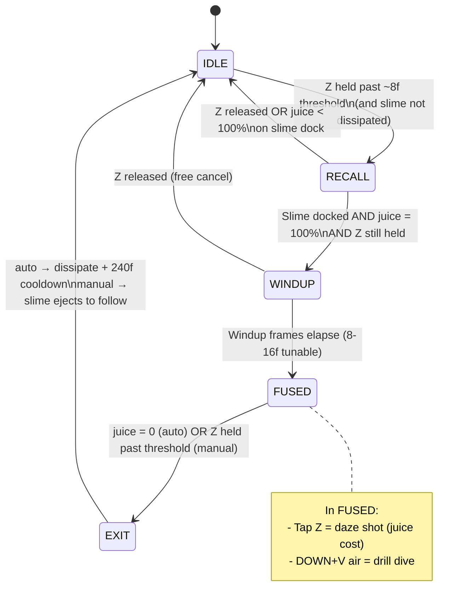

# Phase 30: Fusion Lifecycle Design Doc - Research

**Researched:** 2026-04-19
**Domain:** Design-doc authorship + code archaeology of current fusion + drill-dive behavior
**Confidence:** HIGH (all claims verified from live source)

## Summary

Phase 30 is a **design-only** phase. The single deliverable is `.planning/FUSION-DESIGN.md`,
locked via YAML frontmatter, that (a) narrows the prototype from six fusion abilities to one
(Drill Dive), (b) specifies a unified input model (Z = slime/fusion button, DOWN+V air = dive verb:
pogo unfused, drill fused), (c) defines the `IDLE → RECALL → WINDUP → FUSED → EXIT` FSM under a
100%-gated juice-as-mana economy, and (d) captures current v1.3 drill behavior as the Phase 32
regression target.

The "research" is overwhelmingly **code archaeology**. Every concrete frame count, juice cost, and
velocity cited in the design doc must come from the live source tree — not from training knowledge.
This research file enumerates those values with exact file:line citations so the planner and
writer never guess.

**Primary recommendation:** Write FUSION-DESIGN.md as one comprehensive file following the section
order in the User Constraints below. Use the exact v1.3 values captured in the
**Code Archaeology (v1.3 Facts)** section below as the drill-dive regression contract. Use a
**Mermaid state diagram** for the FSM (no project precedent exists, so picking the format is
Claude's discretion per D-30, and Mermaid renders cleanly in GitHub, Obsidian, VS Code markdown
preview, and on GitHub raw). Define FUS-01/02/03 inline as section-anchored requirements mirroring
the bold-id formatting used in `.planning/milestones/v1.1-REQUIREMENTS.md` (`**FUS-01**: …`).
Validate the doc via content-presence checks — no code, no pytest.

## User Constraints (from CONTEXT.md)

### Locked Decisions

**Scope pivot — one fusion, not six**
- D-01: Prototype ships with one fusion mechanic: Drill Dive. The 5 other v1.1 fusion abilities
  (Slime Ram, Directional Hold, Charge Shot, Bubble Shield, Slime Boost) are cut from the prototype.
- D-02: FUSION-DESIGN.md explicitly lists the cut abilities as "out of prototype scope, revisit
  post-prototype." Code for the cut abilities is stripped in a follow-up phase between 30 and 32.
- D-03: The prototype's fusion loop is: **shoot to daze the boss → drill to finish**.

**Base movement verb — Pogo Dive (unfused)**
- D-04: Unfused DOWN+V in air = pogo bounce (Shovel Knight shovel-drop style). Strikes downward,
  bounces on contact with enemies and breakables only. Pure solid ground = no bounce, just lands.
- D-05: Pogo is free — no juice cost, no cooldown, always available. Juice is reserved for fusion.
- D-06: Pogo teaches the drill's downward commitment before the player ever fuses.

**Fusion verb — Drill Dive (fused)**
- D-07: Fused DOWN+V in air = pure plunge. No bounce. Drills through soft/CRACKED blocks,
  consumes juice per block.
- D-08: Drill ends on: (a) hit truly solid (non-breakable) terrain, (b) juice hits 0 (auto-unfuse
  + dissipate), or (c) manual unfuse via Z-hold mid-drill (tunable — may be disabled if it feels
  wrong in playtest).
- D-09: Drill retains no pogo behavior. Commitment is the point.

**Unified input model — Z is the slime/fusion button**
- D-10: Z semantic is uniform: tap = projectile, hold = toggle fusion state. No mode-specific rebinds.
- D-11: Tap-vs-hold disambiguation uses a short frame threshold (target ~8 frames, tuned in Phase 33).
- D-12: Unfused Z actions: tap = spit (weak, free); hold (juice < 100%) = recall + accelerated
  regen while held; hold (juice = 100% + slime docked) = auto-triggers windup → fuse; release
  before windup completes = slime returns to follow (NOT freeze).
- D-13: Fused Z actions: tap = daze shot (same projectile as spit, upgraded, juice cost); hold
  past threshold = manual unfuse (short windup, slime ejects to follow).
- D-14: Daze shot is mechanically the same projectile as unfused spit with juice cost + daze-on-hit.

**Juice economy — juice-as-mana with a 100% gate**
- D-15: Fusion requires 100% juice to initiate. Binary readiness meter.
- D-16: The 100% gate enables the "oh I need 1 more juice for this puzzle" design primitive.
- D-17: Accelerated regen ritual: while Z held AND slime active (not dissipated) AND slime docked
  at player, juice regenerates at an accelerated rate.
- D-18: Baseline (passive) juice regen continues at a slower rate any time slime is active.
- D-19: Once fused, remaining juice is spent by fused actions. 100% gate applies to entering only.
- D-20: Fused duration = juice at fuse moment minus what fused actions consume.

**Fusion FSM — initiate/sustain/end**
- D-21: FSM phases: `IDLE → RECALL → WINDUP → FUSED → EXIT`.
  - IDLE: slime following, player unfused.
  - RECALL: Z held, slime moving toward player, accelerated regen active if slime docked.
  - WINDUP: juice hit 100% with slime docked, Z still held — short merge animation (target 8-16
    frames, tuned in Phase 33).
  - FUSED: latched state; Z is free for daze shot; DOWN+V air = drill.
  - EXIT: auto (juice=0 → dissipate + cooldown) OR manual (Z-hold → windup → slime ejects unharmed).
- D-22: "Docked" is not a separate state — it's frame 0 of WINDUP.
- D-23: WINDUP release = free cancel. Slime returns to follow. No cost, no punishment.
- D-24: Auto-unfuse on juice=0 → slime dissipates (v1.1 D-05 retained). Dissipation imposes a
  cooldown before recall.

**Contract capture method**
- D-25: Capture current v1.3 drill-dive behavior via code archaeology + written spec.
- D-26: No video/input recordings required. No frame-by-frame diffing infrastructure.
- D-27: The drill-dive contract is a behavioral checklist Phase 32 must verify by inspection +
  smoke test.
- D-28: No pytest stubs required from Phase 30.

**Design doc structure & lock**
- D-29: Single comprehensive file: `.planning/FUSION-DESIGN.md`. Covers: scope pivot rationale,
  input model, FSM, juice economy, drill-dive contract, cut-ability list + rationale, acceptance
  checklist for Phase 32.
- D-30: No separate contract files, no separate FSM diagram artifact. ASCII state table or Mermaid
  diagram inline in the doc is fine.
- D-31: Doc lock mechanism = YAML frontmatter with `status: LOCKED`, `locked_at`, `locked_commit`.
- D-32: FUS-01, FUS-02, FUS-03 defined inline in FUSION-DESIGN.md.

### Claude's Discretion
- Exact frame thresholds (tap-vs-hold, windup duration, unfuse windup duration) — drafted from
  current v1.3 values where they exist; Phase 33 retunes.
- Exact juice costs (spit, daze shot, per-block drill) — carried forward from v1.3; Phase 33 retunes.
- Whether manual unfuse mid-drill is allowed — author as "permitted unless it feels wrong in
  playtest"; Phase 33 may disable.
- Daze-on-hit effect details (duration, stun behavior) — carried forward from existing boss
  stagger logic where one exists.
- How CRACKED_V vertical gating blocks behave under the single-fusion model — drill already handles
  them in v1.1; confirm via code archaeology, doc as-is.
- FSM diagram format (ASCII table vs Mermaid) — author's choice. **Recommendation: Mermaid**
  (renders in GitHub, Obsidian, VS Code preview; no project precedent to mirror).
- Scope pivot rationale framing in the doc — Claude writes, user reviews the lock.

### Deferred Ideas (OUT OF SCOPE)
- **NEW PHASE NEEDED — cut-ability code strip** (between 30 and 32).
- Phase 32 scope shrinks to single-ability refactor.
- Phase 33 scope shrinks to drill-dive feel pass only.
- Post-prototype abilities (ram, hold, charge shot, bubble shield, boost) — not deleted from
  design thinking, just out of scope for this build.
- Manual unfuse mid-drill — allowed by default in doc, flagged for Phase 33 to disable if wrong.
- FUS-01/02/03 defined inline in FUSION-DESIGN.md (no separate REQUIREMENTS file).
- Daze projectile distinctness — prototype uses spit sprite/physics with visual upgrade only.

## Phase Requirements

| ID | Description (to be defined inline in FUSION-DESIGN.md) | Research Support |
|----|---------------------------------------------------------|------------------|
| FUS-01 | **Fusion lifecycle FSM.** Locked design doc defines `IDLE → RECALL → WINDUP → FUSED → EXIT` with explicit activation input (Z-hold), 100% juice gate at WINDUP entry, cancel/release rules at each phase, and auto/manual EXIT paths. | FSM + juice economy sections of this research |
| FUS-02 | **Unified input model.** Locked design doc specifies Z as the slime/fusion button (tap=spit/daze, hold=recall/fuse/manual-unfuse), DOWN+V air as the dive verb (pogo unfused, drill fused), and ~8-frame tap/hold disambiguation threshold. | Input contract section + current-code archaeology |
| FUS-03 | **Drill-dive v1.3 regression contract.** Locked design doc documents current drill-dive behavior — velocity, per-block juice cost, CRACKED_V handling, entry/exit conditions — precisely enough for Phase 32 to verify parity by inspection + smoke test. | **Code Archaeology (v1.3 Facts)** section below |

The planner writes plan tasks against these three IDs. Each FUS-XX must trace to a named section
heading in FUSION-DESIGN.md (see Validation Architecture).

## Architectural Responsibility Map

Phase 30 is design-only — the only "tier" is `.planning/*.md`. For the **implemented** system
that the doc specifies (which Phase 32 builds), the tier ownership is:

| Capability | Primary Tier | Secondary Tier | Rationale |
|------------|-------------|----------------|-----------|
| Fusion FSM state transitions | `src/fusion/` (future, Phase 32) | `src/entities/player.py` (current) | Refactor target; today it lives in Player |
| Juice bookkeeping (consume/regen/refill) | `src/entities/slime.py` | `src/core/tuning.py` (rates) | Juice is slime-owned; tuning reads at use-site |
| Drill physics (velocity, drift, gravity override) | `src/entities/player.py` apply_diving_physics | `src/core/tuning.py` (DRILL_*) | Physics live on the entity |
| Block-break dispatch (CRACKED_V, destructible, solid) | `src/level/map.py` (get_*_at / is_*) | `src/entities/player.py` move_and_collide | Map classifies tiles, player acts on classification |
| Input tap/hold disambiguation | `src/core/input.py` (`was_tap` / `hold_frames`) | — | Already the single owner of frame-threshold logic |
| Event emission (FSM side-channel) | `src/anim/event_bus.py` | gameplay call-sites | Pub/sub per Phase 26 D-13a |
| Doc lock | `.planning/FUSION-DESIGN.md` frontmatter | git commit SHA | YAML frontmatter per D-31 |

This map is informational — Phase 30 writes no code. It helps the planner reason about which parts
of the doc will drive which future files.

## Code Archaeology (v1.3 Facts)

> Every value here is verified from the live source tree as of commit HEAD (Phase 29 signed off,
> v2.0-default preset is active; v1.3-baseline lives at `assets/presets/_v1.3-reference.json`).

### Drill-Dive Contract — Current Behavior (Phase 32 regression target)

| Property | Value | Source | Notes |
|----------|-------|--------|-------|
| Activation input (code) | **DOWN + SPACE (jump)** | `src/entities/player.py:443-456` | **Contradicts** CONTEXT/PROJECT which say DOWN+V. See Known Ambiguities. |
| Activation input (CONTEXT target) | DOWN + V (dash button) | D-07 + CONTEXT-FUSED section | Remap target — must be documented as "current code uses SPACE; doc targets V". |
| Preconditions | `has_drill` item, **airborne** (not grounded), `slime.juice > 0`, slime distance sq < `SLIME_MAX_DIST**2` (=100**2) | `player.py:446-450` | v1.3 does NOT enforce 100% juice — gate is `> 0`. Doc's 100% gate is a new rule. |
| Entry side-effects | `state = "DIVING"`, `fuse(slime)`, `dy = DRILL_SPEED`, `dx = 0`, `slime.consume(DRILL_ACTIVATION_COST)` | `player.py:451-455` | Fuses instantly, no windup animation |
| DRILL_SPEED (vertical velocity) | **2.0 px/frame** (v1.3) / **2.0 px/frame** (v2.0-default) | `physics-schema.json:79` + `_v1.3-reference.json:32` | Same in both presets |
| DRILL_DRIFT_SPEED (horizontal) | **0.5 px/frame** (v1.3 and v2.0-default) | `physics-schema.json:80` + `_v1.3-reference.json:33` | Applied when LEFT/RIGHT held during drill |
| DRILL_ACTIVATION_COST | **5.0 juice** | `physics-schema.json:82` + `_v1.3-reference.json:35` | Paid at entry |
| DRILL_IMPACT_COST | **20.0 juice** | `physics-schema.json:81` + `_v1.3-reference.json:34` | Paid on hitting solid terrain (landing) |
| DRILL_BLOCK_REFUND (soft block passthrough) | **+15.0 juice** | `physics-schema.json:83` + `_v1.3-reference.json:36` | REFUND on destructible that is NOT CRACKED_V |
| DRILL_CRACKED_V_COST (gate block) | **20.0 juice** | `physics-schema.json:131` + `_v1.3-reference.json` carries this via `gates` group | v2.0-default `gates.DRILL_CRACKED_V_COST = 20.0` |
| Gravity during drill | `GRAVITY * FALLING_GRAVITY_MULTIPLIER` applies additively; `dy` re-set to `DRILL_SPEED` each frame in `apply_diving_physics` | `player.py:662-663, 689-693` | Net effect: `dy` clamps to DRILL_SPEED because re-assigned to it in `apply_diving_physics`. Gravity only bites if drill is somehow read-through by another state. |
| MAX_FALL_SPEED clamp | 4.0 (v2.0-default) / 2.5 (v1.3) | `physics-schema.json:47` + `_v1.3-reference.json:14` | Does NOT cap drill — drill explicitly sets `dy = DRILL_SPEED = 2.0` each frame. |
| i-frames during drill | **NONE** | `player.py` grep for `invuln_timer` during DIVING = no hits | Drill is NOT invincible. Ram is invincible (9999 during ram, `DASH_IFRAMES=16` post-ram); drill has nothing. Document this. |
| Block-break path: soft destructible | `level_map.get_destructible_at` → `remove_tile` → `slime.refill(DRILL_BLOCK_REFUND)` → `on_block_break` → early return (continue through) | `player.py:770-786` | Player passes through, drill continues |
| Block-break path: CRACKED_V (gate) | Same path as destructible, but detected via `tile_type == INTGRID_CRACKED_V` (=12) and costs `DRILL_CRACKED_V_COST` instead of refunding | `player.py:781-783` | Player passes through, drill continues |
| Exit condition (a): solid terrain | `move_and_collide` → `collision` true on non-destructible → snap to floor, `is_grounded=True`, `slime.consume(DRILL_IMPACT_COST)`, `emit("drill_impact")`, `state = "IDLE"`, `unfuse(slime)` (NO dissipate) | `player.py:788-802` | Normal exit — slime reforms next to player, no cooldown |
| Exit condition (b): juice empty | In `apply_diving_physics`, if `slime.juice <= 0` → `state = "FALLING"`, `unfuse(slime, dissipate=True)` | `player.py:672-675` | Triggers dissipate + `SLIME_DISSIPATE_COOLDOWN = 240` frames cooldown |
| Exit condition (c): mid-drill jump cancel | In `handle_input`, if `state == "DIVING"` and `btnp("jump")` → `state = "FALLING"`, `unfuse(slime)`, `dy = 0` | `player.py:463-468` | Currently bound to SPACE (same button that started drill). Doc proposes this as Z-hold (manual unfuse) per D-08(c). |
| Block event emission | `event_bus.emit("drill_impact")` on solid landing | `player.py:800` | No per-block-break event currently; doc proposes new `drill_block_break` |
| `on_block_break()` side-effects | Sets `game.shake_timer = DRILL_SHAKE_DURATION` (12 f) + `game.stop_frames = DRILL_HITSTOP_FRAMES` (6 f) | `player.py:235-239` + `physics-schema.json:85-88` | Shake + hitstop only on break, not on activation |

### Current Fusion Entry/Exit Behavior

| Property | Value | Source | Notes |
|----------|-------|--------|-------|
| `fuse(slime)` | Sets `is_fused=True` on both, clears `is_recalling` + `is_holding_position` + `is_charging_recall`, emits `"fuse_start"` | `player.py:89-97` | Single entry point per Pitfall 3 |
| `unfuse(slime, dissipate=False)` | Sets `is_fused=False`, emits `"fuse_end"`; if `dissipate=True` calls `slime.dissipate()`; else `slime.reform(…)` | `player.py:99-110` | Single exit point |
| Auto-fuse trigger (current) | Z held, `was_tap` fails (held past `SPIT_HOLD_THRESHOLD=16`), slime recalled, `update_recall` returns True (arrived), `slime.juice >= max_juice` → `self.fuse(slime)` | `player.py:415-423` | v1.1 D-01/D-02 charge-to-fuse. Already gates on 100% juice — so the 100% gate is a documentation formalization, not a code change |
| Z tap threshold | `SPIT_HOLD_THRESHOLD = 16` frames (tap if held ≤16) | `physics-schema.json:107` + `_v1.3-reference.json:46` | Used by `input_manager.was_tap("spit", 16)` for tap detection. Doc proposes ~8 frames for Phase 33 retune. |
| Z hold threshold (directional hold) | `HOLD_TAP_THRESHOLD = 10` frames | `physics-schema.json:108` + `_v1.3-reference.json:47` | Currently for LEFT/RIGHT directional hold (cut ability), not Z. Relevant reference only. |
| Recall speed | `RECALL_SPEED = 4.0` px/frame | `physics-schema.json:102` + `_v1.3-reference.json:41` | Slime zips toward player at 4 px/frame |
| Recall overlap (docked detection) | `RECALL_OVERLAP_DIST = 4` px (distance threshold for "arrived") | `physics-schema.json:103` | Center-to-center distance ≤4 = docked |
| Windup duration (new) | NOT IN CODE | — | Fuse is instant today. Doc proposes 8-16 frames for Phase 33. |
| MANA_SHIELD_COST (fused damage) | 20.0 juice per hit | `physics-schema.json:104` | v1.1 D-04 retained |
| Juice empty during fuse | `unfuse(slime, dissipate=True)` from shield, ram-end, drill-mid, boost-chain — all paths converge on dissipate | Multiple call sites | Confirmed: every "juice ran out while fused" path triggers dissipate |

### Slime Dissipate / Cooldown

| Property | Value | Source | Notes |
|----------|-------|--------|-------|
| `dissipate()` | Sets `is_dissipated=True`, `dissipate_timer = SLIME_DISSIPATE_COOLDOWN`, clears `is_fused/is_recalling/is_being_absorbed/recall_trail` | `slime.py:82-89` | No juice reset here |
| `SLIME_DISSIPATE_COOLDOWN` | **240 frames** (= 4.0s @ 60fps) | `physics-schema.json:105` + `_v1.3-reference.json:44` | Burnout cooldown before slime reforms |
| Reform on cooldown end | `update_dissipation` ticks timer; at 0 → `juice = max_juice`, calls `reform(…)` | `slime.py:91-101` | Slime reforms at **full juice** after cooldown (v1.1 D-05) |
| During dissipate: recall? | `recall()` early-return if `is_dissipated` | `slime.py:50-51` | Slime is uncontrollable during burnout — this IS the punishment |
| `SLIME_MAX_DIST` (fuse-eligibility range) | 100 px | `physics-schema.json:63` + `_v1.3-reference.json:23` | Drill entry requires `dist_sq < 100**2 = 10000`; likely redundant given recall logic but present |

### Juice Regen — Current Rates (no "accelerated" mode today)

| Property | Value | Source | Notes |
|----------|-------|--------|-------|
| `JUICE_MAX` | 200.0 | `physics-schema.json:68` | Bar capacity |
| `JUICE_REGEN_RATE` | **0.5 juice/frame** (= 30 juice/sec; full refill from 0 in ~6.67s @ 60fps) | `physics-schema.json:69` + `_v1.3-reference.json:26` | Applied each frame in `slime.update` when slime is active (not dissipated, not fused, not holding). `slime.py:166`. |
| Accelerated regen (while Z held + docked) | **NOT IN CODE** | — | New rule from D-17. No current "accelerated regen" exists. Phase 33 tunes; Phase 32 implements. |
| Juice during fuse | Regen does NOT apply while fused (early returns in `slime.update` before regen line) | `slime.py:153-163` | Confirmed: juice is locked during fusion; only drains |

### Event Bus — Current Events

**File:** `src/anim/event_bus.py` (pub/sub, synchronous, module singleton).

Events emitted today (from grep of `event_bus.emit(` in `src/`):

| Event | Emitted At | Notes |
|-------|-----------|-------|
| `fuse_start` | `player.fuse()` | Fires on both v1.1 charge-to-fuse AND drill-dive entry |
| `fuse_end` | `player.unfuse()` | Fires on every exit path (normal, dissipate, damage-break) |
| `drill_impact` | `player.move_and_collide` on solid-hit while DIVING | Only "drill" event that exists today |
| `ram_start` | `player.start_ram()` | Cut ability |
| `ram_impact` | `player.move_and_collide` on CRACKED_H break during ram | Cut ability |
| `charge_shot_fire` | `player.fire_charge_shot()` | Cut ability |
| `boost_tap` | `player.start_boost` + `player.update_boost` | Cut ability |
| `spit` | `slime.spit` | Will also fire for daze shot (same code path) |
| `jump_start`, `jump_released`, `jump_press_airborne`, `fall_start`, `land`, `left_ground`, `wall_touch`, `wall_jump`, `direction_change`, `damaged`, `death` | Misc gameplay | Not relevant to fusion FSM |

**New events proposed by CONTEXT (D-21 FSM + code_context section):**

| Proposed Event | When Fired | Purpose |
|---------------|-----------|---------|
| `drill_start` | Entry to FSM `FUSED` state with DOWN+V held (drill activation) | Anim hook for drill windup/plunge frame |
| `drill_block_break` | Per-block destruction during drill | Distinct from `drill_impact` (which is landing); enables per-break particle/shake |
| `drill_end` | Drill exits (any of three conditions) | Anim hook for drill recoil/landing |
| `manual_unfuse_start` | FUSED → EXIT via Z-hold past threshold | Anim hook for slime ejection windup |

**Naming convention observed:** snake_case, verb-object-tense (`fuse_start`, `ram_impact`,
`boost_tap`, `jump_released`). Proposed events match this convention.

**Event bus location:** `src/anim/event_bus.py` (Phase 26 D-13a — module-level singleton).
The doc should reference this exact path, not `src/core/event_bus.py` as CONTEXT speculates.

### Input Action Names

Source: `src/core/input.py:4-14`.

| Logical Action | Physical Keys | Used For |
|----------------|---------------|----------|
| `jump` | SPACE, GAMEPAD A | Jump AND currently drill-dive activation (DOWN+SPACE) |
| `spit` | Z, J, GAMEPAD B | Slime spit / fusion (Z is the "slime/fusion button" per D-10) |
| `dash` | V, K, GAMEPAD X | Unfused dash / fused ram (the "V button" the doc calls for DOWN+V air = dive verb) |
| `left`, `right`, `up`, `down` | Arrows/WASD/D-pad | Directional input |
| `pause`, `confirm` | ESC / RETURN | Meta |

**Key insight for the doc:** When CONTEXT D-04/D-07 say "DOWN+V in air", they mean the `dash`
**logical** action. The current code routes drill-dive through the `jump` action (DOWN+SPACE) —
this is a v1.3 implementation detail that PROJECT.md itself describes with the phrase "V button
unified (D-07/D-10/D-22) V=dash unfused, DOWN+V=drill dive; kick removed". The doc must document
the **target** input (DOWN+`dash`/V) and note that the Phase 32 refactor will remap activation
from `jump` to `dash` as part of the single-fusion-ability refactor.

### Existing Pogo / Bounce Logic

**None.** Grep for `pogo`, `bounce`, `shovel` across `src/` returned zero hits. Every mention is in
`.planning/**` context docs. **Pogo is a genuinely new verb** — no code to regression-check, no
current behavior to document. FUSION-DESIGN.md describes intended behavior only; Phase 32 (or a
later phase) implements.

## Standard Stack

Phase 30 produces one markdown file. No libraries installed. For completeness:

| "Library" | Version | Purpose | Why Standard |
|-----------|---------|---------|--------------|
| Markdown with YAML frontmatter | N/A | Doc format + lock mechanism | Git-native, grep-able, no tooling burden |
| Mermaid (state-diagram v2) | Rendered by GitHub / Obsidian / VS Code preview | FSM diagram per D-21/D-30 | No project precedent either way — Claude's discretion per D-30. Mermaid renders cleanly in all the tools the user is known to use; ASCII is also acceptable per D-30. |
| git rev-parse | Any | Obtain `locked_commit` SHA post-merge | Only lock mechanism |

### Alternatives Considered

| Instead of | Could Use | Tradeoff |
|------------|-----------|----------|
| YAML frontmatter lock | Plaintext "LOCKED: <sha>" header | YAML is parseable by future tools (Phase 32 plan references `locked_commit` programmatically per CONTEXT code_context). Chose YAML. |
| Mermaid FSM | ASCII table / ASCII-art graph | Mermaid renders as a picture in GitHub PRs; ASCII requires mental parsing. Both work per D-30. |
| Single locked file | Split doc + contract JSON | D-29 locks to single file. Settled. |

## Architecture Patterns

### System Architecture Diagram (Conceptual flow of the doc itself)

```
User reads CONTEXT.md
        │
        ▼
FUSION-DESIGN.md (single file)
        │
        ├── Frontmatter (status: LOCKED, locked_at, locked_commit)
        ├── § Scope pivot rationale
        ├── § Unified input model (FUS-02)
        ├── § Fusion FSM (FUS-01) ── contains Mermaid state diagram
        ├── § Juice economy (FUS-01)
        ├── § Drill-dive contract (FUS-03) ── anchors Phase 32 regression
        ├── § Cut-ability list + rationale
        └── § Acceptance checklist (for Phase 32)
        │
        ▼
Phase 32 reads frontmatter → verifies locked_commit matches build target
Phase 33 reads drill-dive section → retunes against documented v1.3 values
```

### Recommended Project Structure (for FUSION-DESIGN.md)

```
.planning/
├── PROJECT.md
├── REQUIREMENTS.md
├── ROADMAP.md
├── STATE.md
└── FUSION-DESIGN.md          ← new top-level doc (sibling of the others)
```

The doc lives at the top of `.planning/`, not inside `phases/30-.../`, because D-29 says it is a
locked top-level artifact referenced by Phase 32 and Phase 33. The phase folder gets the
RESEARCH + PLAN + SUMMARY as usual.

### Pattern 1: Locked-Doc YAML Frontmatter

**What:** YAML block at top of the file carrying `status`, `locked_at`, `locked_commit`.
**When to use:** Any doc that downstream phases consume as a contract (this is the first such doc
in the project — no precedent to mirror, so this phase defines the pattern).
**Example:**
```markdown
---
status: LOCKED
locked_at: 2026-04-19
locked_commit: <sha-filled-in-at-lock-commit>
---

# Fusion Lifecycle Design (v2.0 prototype)
...
```

**Lock workflow:** Write the doc with `locked_commit: TBD`, commit it, then a second commit
amends `locked_commit` to the SHA of the first commit. Alternatively, write → commit → record the
resulting SHA → amend in-place and force-commit. Simplest: commit with `TBD`, then run
`git rev-parse HEAD`, replace `TBD` with that SHA, commit again with message "lock FUSION-DESIGN at
<sha>". The planner should decide exact sequencing.

### Pattern 2: Inline REQ-ID Definition

**What:** Bold-id paragraphs like `**FUS-01**: <description>.`
**When to use:** Defining requirements that do not live in a separate REQUIREMENTS.md.
**Example (from `.planning/milestones/v1.1-REQUIREMENTS.md:19-20`):**
```markdown
- [x] **ABL-01**: Slime Ram fusion (Forward Dash) with horizontal gating capability.
- [x] **ABL-02**: CRACKED_V vertical gating via Drill Dive (down) and Slime Boost (up). …
```

**For Phase 30 inline:**
```markdown
## Requirements (defined in this document)

- **FUS-01**: Fusion lifecycle FSM defines IDLE → RECALL → WINDUP → FUSED → EXIT with
  activation input, 100% juice gate, and auto/manual exit paths. See § Fusion FSM.
- **FUS-02**: Unified input model — Z for slime/fusion, DOWN+V for dive verb. See § Input Model.
- **FUS-03**: Drill-dive v1.3 regression contract — documented values serve as Phase 32's
  parity target. See § Drill-Dive Contract.
```

### Pattern 3: Mermaid State Diagram (proposed — no precedent)

**What:** Fenced ```mermaid block with `stateDiagram-v2`.
**When to use:** Any FSM that benefits from visual rendering.
**Example target output (to place in FUSION-DESIGN.md § Fusion FSM):**

````markdown

````

ASCII table fallback (in case Mermaid is rejected):

| From | To | Trigger | Side effects |
|------|----|---------|--------------|
| IDLE | RECALL | Z held ≥8f, slime not dissipated | Slime begins recall |
| RECALL | IDLE | Z released OR slime docks with juice<100% | Slime returns to follow |
| RECALL | WINDUP | Slime docks AND juice=100% AND Z still held | Windup timer starts |
| WINDUP | IDLE | Z released | Slime returns to follow (no cost) |
| WINDUP | FUSED | Windup frames elapse | `fuse_start` emitted |
| FUSED | EXIT | juice=0 (auto) OR Z held past threshold (manual) | See EXIT |
| EXIT (auto) | IDLE | 240-frame cooldown | Dissipate + reform at full juice |
| EXIT (manual) | IDLE | Ejection windup | Slime reforms next to player |

### Anti-Patterns to Avoid

- **Anti-pattern: Guessing v1.3 values.** Every concrete number in FUSION-DESIGN.md § Drill-Dive
  Contract MUST cite the source file (`physics-schema.json` key or `player.py` line). Prose like
  "about 20 juice" is wrong; "20 juice (physics-schema.json `DRILL_IMPACT_COST`)" is right.
- **Anti-pattern: Specifying the FSM in terms of the `jump` action.** The doc should speak in
  design terms — "the dive verb button" or "V (`dash` action)" — and note the Phase 32 remap as
  an implementation detail.
- **Anti-pattern: Defining implementation for cut abilities.** Cut abilities get a one-line
  rationale each, nothing more. No FSM entries, no juice math. D-02.
- **Anti-pattern: Duplicating v1.1 REQUIREMENTS text.** FUS-01/02/03 are net-new; they are NOT
  revivals of ABL-01..06. Frame them as prototype-scoped replacements.
- **Anti-pattern: Defining anim timing in this doc.** Windup duration ranges (e.g. "8-16f") are
  targets; concrete values are set in Phase 33. The doc says "target range" and cites the phase
  that locks it.
- **Anti-pattern: Silent lock.** The lock commit must be a distinct git commit whose SHA is then
  written into the frontmatter; otherwise `locked_commit` is meaningless.

## Don't Hand-Roll

| Problem | Don't Build | Use Instead | Why |
|---------|-------------|-------------|-----|
| FSM rendering | Manual SVG / PNG diagram | Mermaid fenced block | Text-diffable, git-friendly, renders everywhere |
| Doc lock mechanism | New custom format | YAML frontmatter | Widely parseable; grep/awk/yaml-parsing all work |
| Requirement IDs | New scheme | Existing bold-ID convention from `v1.1-REQUIREMENTS.md` | Mirror established style |
| Frame-count / juice-cost source | Transcribe from memory | Pull from `physics-schema.json` + `_v1.3-reference.json` | Training knowledge is stale; schema is canonical |
| Event names | Invent new convention | Mirror existing snake_case verb-noun-tense | `fuse_start`, `ram_impact`, `drill_impact` pattern is set |

**Key insight:** Phase 30 writes no code and installs no tooling. Every "don't hand-roll"
item here is a convention-mirroring rule: reuse the project's existing patterns for doc format,
requirement IDs, and event names.

## Runtime State Inventory

Phase 30 is doc-only — no rename, no refactor, no migration. Runtime state inventory not applicable.

Explicit per-category verification:

| Category | Items Found | Action Required |
|----------|-------------|-----------------|
| Stored data | None — phase adds a markdown file, no schema mutation | None |
| Live service config | None | None |
| OS-registered state | None | None |
| Secrets/env vars | None | None |
| Build artifacts | None — no new Python package, no install step | None |

## Common Pitfalls

### Pitfall 1: v1.3 vs v2.0-default value drift

**What goes wrong:** Drill values in the doc are pulled from `physics-schema.json` (v2.0-default,
currently active) instead of `_v1.3-reference.json` (the actual frozen v1.3 baseline).
**Why it happens:** `tuning.get_baseline()` returns the v2.0-default baked at `load()` time — NOT
v1.3. v1.3 is a separate preset file. `assets/presets/_v1.3-reference.json` is the real v1.3.
**How to avoid:** For drill-dive contract values, **cite `_v1.3-reference.json`** for all drill
movement/cost keys. For drill-speed/drift/cost the v2.0-default happens to match v1.3 (2.0, 0.5,
5.0, 20.0, 15.0), but confirm per-value. Walk/jump/gravity values DIVERGE between v1.3 and v2.0 —
those are irrelevant to the drill contract but must not leak in.
**Warning signs:** A value in the doc that matches v2.0-default but differs from v1.3 (e.g.
`MAX_WALK_SPEED` — v1.3 is 1.25, v2.0 is 1.9).

### Pitfall 2: "100% juice gate" framed as a code change in the doc

**What goes wrong:** Doc says "add a 100% juice gate" implying new code in Phase 32.
**Why it happens:** Easy to read D-15 as a refactor requirement.
**How to avoid:** The 100% gate **already exists** for the v1.1 charge-to-fuse path
(`player.py:422` — `if arrived and slime.juice >= slime.max_juice`). The doc formalizes this
existing behavior and extends it to the drill-dive entry path (which currently only requires
`> 0` juice — `player.py:447`). Frame D-15 as "the drill-dive activation adopts the same 100%
gate that charge-to-fuse already uses" — Phase 32 aligns, not invents.
**Warning signs:** Doc language like "implement 100% gate" vs "document/extend the existing
100% gate to drill-dive".

### Pitfall 3: Conflating `is_charging_recall` with RECALL FSM state

**What goes wrong:** Doc uses the current `is_charging_recall` flag as the RECALL state.
**Why it happens:** Name similarity.
**How to avoid:** `is_charging_recall` is a **player-side** bool; RECALL is a **FSM** state. They
overlap conceptually but the doc should speak in FSM-state terms, not flag-names. Phase 32 may
collapse the flag into the FSM or replace it.
**Warning signs:** Doc references `is_charging_recall` or `self.state == "DIVING"` — those are
implementation names that belong in code, not in the locked design.

### Pitfall 4: Missing cross-reference for locked_commit semantics

**What goes wrong:** Doc frontmatter declares `locked_commit: <sha>` but never explains what the
SHA points at.
**Why it happens:** First locked doc in the project — no precedent.
**How to avoid:** Include a short Lock Protocol section in FUSION-DESIGN.md explaining that
`locked_commit` is the git SHA at which the doc transitioned to LOCKED, and that any edit after
that requires (a) bumping `status` through a new state or (b) getting user approval to re-lock at
a new SHA.
**Warning signs:** Frontmatter present but no prose explaining the lock contract.

### Pitfall 5: Writing per-ability contracts for cut abilities

**What goes wrong:** Doc enumerates ram/hold/charge-shot/shield/boost with full contracts.
**Why it happens:** ROADMAP still lists ABL-01..06; the writer mirrors that.
**How to avoid:** D-02 says cut abilities get a one-line rationale each. Full contracts = scope
creep that inflates the doc and invites Phase 33 work that is explicitly out of scope.
**Warning signs:** Doc sections >1 paragraph per cut ability.

### Pitfall 6: Authoring the FSM before nailing the input model

**What goes wrong:** FSM transitions mention "Z tap" / "Z hold" but the Input Model section
hasn't yet been written to disambiguate them.
**Why it happens:** Writing the diagram feels like the "main thing" and happens first.
**How to avoid:** Write the Input Model section FIRST (D-10..D-14), then the FSM can reference
it. Ordering in the doc: Scope → Input Model → FSM → Juice Economy → Drill Contract → Cuts →
Acceptance.

### Pitfall 7: Locking the doc before FUS-01/02/03 are named

**What goes wrong:** Doc is LOCKED but the three requirement IDs are introduced in passing in
prose, not defined as anchor targets.
**Why it happens:** ROADMAP mentions them but no REQUIREMENTS doc defines them.
**How to avoid:** Use inline bold-id pattern (`**FUS-01**: …`) and give each ID an explicit
one-paragraph definition AND a section-heading anchor so Phase 32 plans can link to them.
**Warning signs:** Searching the doc for `FUS-01` returns prose paragraphs but no `### FUS-01`
heading or boldface definition.

## Code Examples

Verified v1.3 behavior, drawn from live source — these are the exact fragments the drill-dive
contract section should reference.

### Drill entry (current, DOWN+SPACE)
```python
# Source: src/entities/player.py:443-456
if input_manager.btnp("jump") and self.state not in ("DIVING", "DASHING", "RAMMING"):
    if (input_manager.btn("down") and self.has_drill
            and not self.is_grounded and slime.juice > 0):
        # DOWN+SPACE = Drill Dive (D-12 remap from DOWN+V)
        dist_sq = (self.x - slime.x)**2 + (self.y - slime.y)**2
        if dist_sq < tuning.SLIME_MAX_DIST**2:
            self.state = "DIVING"
            self.fuse(slime)
            self.dy = tuning.DRILL_SPEED             # 2.0
            self.dx = 0
            slime.consume(tuning.DRILL_ACTIVATION_COST)  # 5.0
            return
```

### Drill physics tick
```python
# Source: src/entities/player.py:662-675
def apply_diving_physics(self, slime):
    self.dy = tuning.DRILL_SPEED              # clamp to 2.0 each frame
    if input_manager.btn("left"):
        self.dx = -tuning.DRILL_DRIFT_SPEED   # -0.5
    elif input_manager.btn("right"):
        self.dx = tuning.DRILL_DRIFT_SPEED    # +0.5
    else:
        self.dx = 0
    if slime.juice <= 0:
        self.state = "FALLING"
        self.unfuse(slime, dissipate=True)    # exit (b)
```

### Drill block-break branch
```python
# Source: src/entities/player.py:770-786 (simplified)
if self.state == "DIVING" and slime:
    tile_coord = self.level_map.get_destructible_at(...)
    if tile_coord:
        tx, ty = tile_coord
        tile_type = self.level_map.get_tile(tx, ty)
        self.level_map.remove_tile(tx, ty)
        self.game.spawn_explosion(...)
        if tile_type == INTGRID_CRACKED_V:         # 12
            slime.consume(tuning.DRILL_CRACKED_V_COST)   # 20.0
        else:
            slime.refill(tuning.DRILL_BLOCK_REFUND)      # +15.0
        self.on_block_break()                      # shake + hitstop
        return
```

### Drill landing (exit a)
```python
# Source: src/entities/player.py:797-802
if self.state == "DIVING" and slime:
    slime.consume(tuning.DRILL_IMPACT_COST)        # 20.0
    event_bus.emit("drill_impact")
    self.state = "IDLE"
    self.unfuse(slime)                             # normal, no dissipate
```

### Drill mid-dive cancel (exit c)
```python
# Source: src/entities/player.py:463-468
if self.state == "DIVING":
    if input_manager.btnp("jump"):
        self.state = "FALLING"
        self.unfuse(slime)                         # no dissipate
        self.dy = 0
    return
```

### Charge-to-fuse 100% gate (existing — drill should adopt this same rule)
```python
# Source: src/entities/player.py:419-423
if self.is_charging_recall and slime.is_recalling:
    arrived = slime.update_recall(self.x, self.y)
    if arrived and slime.juice >= slime.max_juice:  # <-- already 100%-gated
        self.fuse(slime)
```

## State of the Art

| Old Approach | Current Approach | When Changed | Impact |
|--------------|------------------|--------------|--------|
| 6 fusion abilities (ABL-01..06) | 1 fusion ability (Drill Dive) | Phase 30 CONTEXT (2026-04-19) | Scope-pivot; doc formalizes it |
| Drill activation via DOWN+SPACE | Drill activation via DOWN+V (`dash` action) | Phase 32 refactor target | Input remap documented in FUSION-DESIGN |
| Fuse is instant on slime dock + 100% juice | Fuse has WINDUP phase (8-16f tunable) | Phase 32/33 | New state in FSM |
| No accelerated regen | Accelerated regen while Z-held + slime-docked | Phase 32/33 | New rule; doc specifies |
| Drill has no i-frames | Drill i-frame policy: **to be decided in doc** | Phase 30 discretion | v1.3 had none; doc should carry that forward unless user says otherwise |
| Mana shield pattern (fused damage → juice) | Retained | v1.1 D-04 | No change |
| Slime dissipate cooldown 240f | Retained | v1.1 D-05 | No change |

**Deprecated/outdated (from prototype scope):**
- **Slime Ram, Directional Hold, Charge Shot, Bubble Shield, Slime Boost**: cut from prototype.
  Code still present; cut-ability code-strip phase (new, between 30 and 32) removes them.
- **Kick mechanic**: already removed pre-v2.0 (Phase 29 CONTEXT notes). Not in current code.

## Assumptions Log

> Every factual claim in this research is `[VERIFIED]` against the live codebase unless tagged
> below. Items in this log need user confirmation before becoming locked doc content.

| # | Claim | Section | Risk if Wrong |
|---|-------|---------|---------------|
| A1 | Mermaid is the preferred FSM format (no project precedent — Claude's discretion per D-30) | Standard Stack + Pattern 3 | Low — D-30 explicitly permits either ASCII or Mermaid; swap is trivial |
| A2 | v1.3 drill values are authoritative for FUS-03 (not v2.0-default where they match by coincidence) | Drill-Dive Contract | Medium — if the user considers v2.0-default the regression target, the Phase 32 test is against different numbers. CONTEXT says "current v1.3 drill-dive behavior" → v1.3 confirmed. |
| A3 | Drill has NO i-frames in v1.3 and the doc should preserve that (verifiable — but "preserve" is a design choice not a code fact) | Drill-Dive Contract → "i-frames during drill: NONE" | Low — code shows no iframes; user may want to ADD them in the doc as a design correction. Flag for user. |
| A4 | The `drill_block_break` event is new (not merely renamed from `drill_impact`) | Event Bus section | Low — `drill_impact` currently fires on landing; `drill_block_break` would fire per destructible break. These are semantically distinct, not aliases. |
| A5 | "Lock commit" protocol = two-commit dance (write w/ TBD SHA → commit → amend SHA → commit again) | Pattern 1 | Low — alternative is single commit with post-hoc SHA injection via git note. Either works; planner decides. |

**Claims tagged `[ASSUMED]` inline in this doc:** none — all values cite file:line.

## Open Questions

1. **Does the doc state drill-dive i-frames = NONE (preserve v1.3) or propose adding them?**
   - What we know: v1.3 has no i-frames during drill. Ram has i-frames, dash has i-frames.
   - What's unclear: Is the doc a pure regression target (document what IS) or a design evolution
     (document what SHOULD BE for v2.0)? CONTEXT says "capture current v1.3 drill-dive behavior as
     the Phase 32 regression target" (FUS-03 framing) — which argues for preserving no-i-frames.
     But the parent goal is "juice-as-mana fusion redesign" which might invite the question.
   - Recommendation: Document v1.3 behavior (no i-frames) as FUS-03 regression target. If the
     user wants i-frames, that's a Phase 33 feel-pass question, not a Phase 30 design question.
     Flag in the doc as an open design question for Phase 33 to revisit.

2. **Does FUS-02 include the activation-button remap (SPACE → V) or is that Phase 32's call?**
   - What we know: PROJECT.md says "V=dash unfused, DOWN+V=drill dive" but code uses SPACE.
     CONTEXT D-07 says "Fused DOWN+V in air = pure plunge".
   - What's unclear: The doc's input-model section must pick a button. If it names V, Phase 32's
     refactor includes a button remap. If it names SPACE, the refactor matches current code.
   - Recommendation: Name V. PROJECT.md already authoritatively declares V as the drill button.
     The fact that code uses SPACE is a v1.3 implementation detail; Phase 32 is the right place to
     fix it. Document this explicitly as "current code uses SPACE (`jump`); Phase 32 remaps to V
     (`dash`) per PROJECT.md D-07/D-10/D-22."

3. **Is the `manual_unfuse_start` event emitted on Z-hold-press (windup start) or after the
   unfuse windup completes?**
   - What we know: D-21 says manual exit goes through a "windup" step before slime ejects.
   - What's unclear: Which transition fires `manual_unfuse_start`?
   - Recommendation: `manual_unfuse_start` fires at windup-begin (Z crosses hold threshold while
     FUSED). Anim hooks want the earliest possible signal. The already-existing `fuse_end` fires
     at the actual unfuse moment.

4. **Does the FSM's WINDUP "free-cancel" apply to the manual-unfuse windup too?**
   - What we know: D-23 says "WINDUP release = free cancel" in the context of fusion entry.
   - What's unclear: When Z is held to manually unfuse and the user releases mid-windup, does
     that cancel (stay fused) or commit (unfuse anyway)?
   - Recommendation: Symmetric behavior — cancel. "Release during any windup = abort." Document
     explicitly; flag for Phase 33 to validate in playtest.

5. **Does the doc commit to an accelerated-regen multiplier value or leave it to Phase 33?**
   - What we know: D-17 introduces accelerated regen as a new rule. Phase 33 retunes.
   - What's unclear: Does the doc say "accelerated regen rate = TBD in Phase 33" or propose a
     draft (e.g. 2x JUICE_REGEN_RATE)?
   - Recommendation: Propose a draft (2x = 1.0/frame = 100 juice in 2s) and flag "Phase 33 tunes."
     Draft anchors the design; label makes it not binding.

## Environment Availability

Phase 30 is markdown authorship. No external tools, runtimes, or services required beyond:

| Dependency | Required By | Available | Version | Fallback |
|------------|-------------|-----------|---------|----------|
| git | Obtaining `locked_commit` SHA | ✓ | 2.x+ (project is a git repo) | — |
| Markdown rendering | Human review of the doc | ✓ | GitHub / Obsidian / VS Code preview all installed per user workflow | ASCII-only doc works without rendering |
| Mermaid support | FSM diagram | ✓ (GitHub, Obsidian, VS Code all ship with Mermaid) | — | ASCII table fallback (provided in Pattern 3) |
| Text editor | Writing the file | ✓ | Any | — |

**No blocking dependencies. No fallback-required dependencies.**

## Validation Architecture

> Phase 30 is design-only. "Tests" are structural checks against the locked markdown file.
> No pytest, no runtime validation.
> Per D-28, pytest stubs are explicitly NOT required.

### Test Framework
| Property | Value |
|----------|-------|
| Framework | Manual doc-content checks (grep + git) |
| Config file | — (no test framework) |
| Quick run command | `grep -l 'status: LOCKED' .planning/FUSION-DESIGN.md && grep -c '^## ' .planning/FUSION-DESIGN.md` |
| Full suite command | See per-check commands in the table below |

**Rationale for no framework:** The deliverable is a locked markdown file. Doc-existence,
frontmatter-presence, and section-heading-presence are each a one-line grep. A pytest wrapper
would add zero value and pull pytest into a design phase. The checks below ARE the "suite."

### Phase Requirements → Content Check Map

| Req ID | Behavior | Check Type | Command (run from repo root) | Expected Result |
|--------|----------|-----------|------------------------------|-----------------|
| FUS-01 | FSM section defines IDLE→RECALL→WINDUP→FUSED→EXIT | Section presence | `grep -n '^## .*FSM' .planning/FUSION-DESIGN.md` | ≥1 match naming the FSM section |
| FUS-01 | All five FSM states are named | Content presence | `for s in IDLE RECALL WINDUP FUSED EXIT; do grep -q "\\b$s\\b" .planning/FUSION-DESIGN.md \|\| echo "MISSING: $s"; done` | No MISSING output |
| FUS-01 | Juice-economy section includes 100% gate rule | Content presence | `grep -n '100%' .planning/FUSION-DESIGN.md` | ≥1 match near juice-economy section |
| FUS-02 | Input model names Z and V with tap/hold semantic | Content presence | `grep -nE '(Z.*tap\|Z.*hold\|DOWN.*V)' .planning/FUSION-DESIGN.md` | ≥3 matches |
| FUS-02 | Tap/hold threshold is quantified (frame count) | Content presence | `grep -nE '[0-9]+[[:space:]]*frame' .planning/FUSION-DESIGN.md` | ≥1 match near input model section |
| FUS-03 | Drill-dive contract section exists | Section presence | `grep -n '^## .*[Dd]rill' .planning/FUSION-DESIGN.md` | ≥1 match |
| FUS-03 | DRILL_SPEED value documented | Content presence | `grep -n 'DRILL_SPEED' .planning/FUSION-DESIGN.md` | ≥1 match |
| FUS-03 | DRILL_IMPACT_COST value documented | Content presence | `grep -n 'DRILL_IMPACT_COST' .planning/FUSION-DESIGN.md` | ≥1 match |
| FUS-03 | CRACKED_V handling documented | Content presence | `grep -n 'CRACKED_V' .planning/FUSION-DESIGN.md` | ≥1 match |
| FUS-03 | Three exit conditions documented (solid, juice=0, manual cancel) | Content presence | Manual review or `grep -nE '(solid\|juice.*0\|cancel)' .planning/FUSION-DESIGN.md \| wc -l` | ≥3 distinct matches |
| FUS-01/02/03 | Each REQ-ID appears as a bold or heading anchor | Content presence | `for r in FUS-01 FUS-02 FUS-03; do grep -qE "(^##.*$r\|\\*\\*$r\\*\\*)" .planning/FUSION-DESIGN.md \|\| echo "MISSING-DEF: $r"; done` | No MISSING-DEF output |
| LOCK-01 | Doc exists at expected path | File existence | `test -f .planning/FUSION-DESIGN.md && echo OK` | `OK` |
| LOCK-02 | Frontmatter `status: LOCKED` present | Frontmatter check | `head -10 .planning/FUSION-DESIGN.md \| grep -E '^status:\s*LOCKED'` | ≥1 match |
| LOCK-03 | Frontmatter `locked_at` is a date (YYYY-MM-DD) | Frontmatter check | `head -10 .planning/FUSION-DESIGN.md \| grep -E '^locked_at:\s*[0-9]{4}-[0-9]{2}-[0-9]{2}'` | ≥1 match |
| LOCK-04 | Frontmatter `locked_commit` is a 7+ char hex SHA | Frontmatter check | `head -10 .planning/FUSION-DESIGN.md \| grep -E '^locked_commit:\s*[0-9a-f]{7,40}'` | ≥1 match (post-lock-commit only — initial write may use `TBD`) |
| CUT-01 | Cut abilities enumerated | Content presence | `for a in Ram "Directional Hold" "Charge Shot" "Bubble Shield" "Slime Boost"; do grep -q "$a" .planning/FUSION-DESIGN.md \|\| echo "MISSING-CUT: $a"; done` | No MISSING-CUT output |
| ACCEPT-01 | Acceptance-checklist section exists for Phase 32 | Section presence | `grep -n '^## .*[Aa]cceptance' .planning/FUSION-DESIGN.md` | ≥1 match |

### Sampling Rate
- **Per task commit:** Run file-existence + frontmatter checks (LOCK-01, LOCK-02, LOCK-03):
  `test -f .planning/FUSION-DESIGN.md && head -10 .planning/FUSION-DESIGN.md | grep -E '^(status|locked_at):'`
- **Per wave merge:** Run the full grep table above (one-liner compound `&&`).
- **Phase gate:** All 18 rows in the Content Check Map pass, PLUS user sign-off on the locked doc.
  `locked_commit: TBD` is PERMISSIBLE during plan execution but MUST be a real SHA before the
  phase closes.

### Wave 0 Gaps

No test files needed. No fixtures. No framework install. No conftest.

- [ ] **`.planning/FUSION-DESIGN.md`** (the deliverable itself; Wave 1 writes it)
- [ ] Lock-commit sequencing documented in Phase 30 PLAN (who runs `git rev-parse`, when the
  frontmatter amendment happens) — this is planner scope, not Wave 0.

**Framework install:** None.

## Project Constraints (from `memory/MEMORY.md` and project conventions)

- **Avoid magic numbers** (MEMORY: `feedback_magic_numbers.md`). The doc should cite named constants
  (`DRILL_SPEED`, `DRILL_IMPACT_COST`) rather than raw numbers, and when it does cite raw numbers
  (e.g. "target ~8 frames for tap/hold disambiguation") the accompanying prose names what the
  number represents.
- **Block gate hierarchy** (MEMORY: `project_block_gate_hierarchy.md`) — drill is the CRACKED_V
  opener. The drill-dive contract section must explicitly tie DRILL to CRACKED_V per this rule.
- **Door event-gated system** (MEMORY) — unrelated to fusion; no action.
- **Reanimator-style anim architecture** (MEMORY) — events are a side-channel, not animation
  inputs. When the doc lists new events (`drill_start`, etc.), it should flag them as anim
  hooks that Phase 31 subscribes to, NOT as gameplay inputs that drive the anim FSM.
- **Worktree merges cause regressions** (MEMORY) — relevant to the lock-commit workflow. After
  the lock commit is written, diff-verify nothing regressed before considering the phase closed.
- **Push before worktree execution** (MEMORY) — Phase 30 is authorship-only and likely runs on
  main, but the planner should still include a "push before any worktree agent" note if the plan
  splits into parallel tasks.

## Sources

### Primary (HIGH confidence)
- `src/entities/player.py` — current fusion, drill-dive, exit-path behavior (lines 89-110,
  443-468, 662-675, 770-802)
- `src/entities/slime.py` — `dissipate`, `recall`, juice regen (lines 48-101, 166)
- `src/anim/event_bus.py` — event bus shape and naming convention (full file, 25 lines)
- `src/anim/player_anim.py` — anim FSM pattern for analogy (full file, 70 lines)
- `src/core/input.py` — action name mapping (full file, 63 lines)
- `src/core/tuning.py` — loader + `get_baseline()` semantics (lines 118-127)
- `src/level/map.py` — destructible/CRACKED_V detection (lines 375-412)
- `assets/physics-schema.json` — current v2.0-default values (all `drill`, `slime_juice`, `fusion`
  groups, lines 67-110, 130-133)
- `assets/presets/_v1.3-reference.json` — frozen v1.3 values (full file, 64 lines)
- `.planning/PROJECT.md` — core value, V-button unification declaration
- `.planning/REQUIREMENTS.md` — `v1.1-REQUIREMENTS.md` convention for inline bold-ID definitions
- `.planning/ROADMAP.md` — Phase 30 entry, Phase 32 hard-gate dependency
- `.planning/STATE.md` — current milestone position
- `.planning/phases/29-player-movement-feel-pass/29-CONTEXT.md` — v1.3 baseline immutability rule
- `.planning/phases/29-player-movement-feel-pass/29-FEEL-TARGETS.md` — precedent for feel-target
  table format (for Phase 30 acceptance checklist)
- `.planning/phases/30-fusion-lifecycle-design-doc/30-CONTEXT.md` — PRIMARY, user decisions
- `.planning/milestones/v1.1-REQUIREMENTS.md` — bold-id requirement convention

### Secondary (MEDIUM confidence)
- `.planning/milestones/v1.1-phases/08-new-fusion-abilities/08-03-PLAN.md` — charge-to-fuse
  historical context (partial read)

### Tertiary (LOW confidence)
None — every claim cites a live file.

## Metadata

**Confidence breakdown:**
- Code-archaeology values: **HIGH** — every number comes from a verified `physics-schema.json`
  key or `player.py` line. Zero training-knowledge claims.
- FSM proposal: **HIGH** for the state transitions (follow CONTEXT D-21 directly); **MEDIUM** for
  event-name proposals (new events; naming convention is verified but specific names may be user-
  revised).
- Mermaid-vs-ASCII: **MEDIUM** — no project precedent. D-30 permits either. Recommendation is
  Claude's judgment, easily swapped.
- Lock-commit workflow: **MEDIUM** — first locked doc in project, pattern is being established
  here. Two-commit dance is a safe default but the planner may pick a different mechanism.

**Research date:** 2026-04-19
**Valid until:** 2026-05-19 (30 days — tuning values rarely change mid-phase; if Phase 33 ships
first and changes drill values, the Drill-Dive Contract section needs re-verification against the
new `_v1.3-reference.json` equivalent before the doc lock finalizes)
